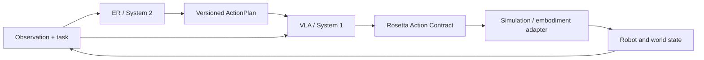
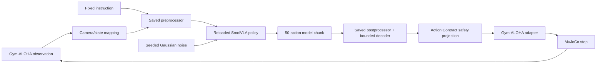

# M2 SmolVLA architecture and navigation

This source distribution contains reusable implementation, contracts, tests and
required configurations. Research reports and historical run narratives are
retained locally, outside Git. M2 remains incomplete. Passing offline checks
does not establish policy task success or authorize training.

Read AGENTS.md, this map and the relevant component documentation before edits.
For a historical experiment, obtain its original hash-bound plan and evidence;
missing evidence must fail closed, never be replaced by invented success.
Historical configs remain immutable; changed implementations require new plans.

The geometry-teacher protocol validates executable source/config identities and
the frozen action, joint, collision, solver and split contracts. It does not
read or checksum historical research reports. The 0.01-rad physical margin,
0.03540462255477905-rad tracking reserve and their command-margin sum remain
unchanged. This separation is not a new geometry or policy acceptance result.

Executable protocol inputs previously stored alongside reports are preserved
byte-for-byte at `configs/vla/iris_baseline_1280.yaml`,
`configs/vla/canonical_posttrain_gate_004.json` and
`configs/sim/teacher_gate_protocol.json`. Historical source pins remain frozen;
new code must be registered separately before execution. Offline tests bind
synthetic operands to real digests instead of publishing historical run reports.
Canonical schema inspection can omit runtime-input access explicitly; actual
post-training callers still validate runtime inputs by default.

## 3. System boundary

Rosetta Reality separates low-frequency reasoning, high-frequency control and
embodiment execution:



The current M2 evaluation does not claim ER/VLA integration. It conditions
SmolVLA with a fixed insertion instruction and directly evaluates the VLA,
Action Contract and simulator loop. M3 remains blocked until M2 Gate 4 passes
and Qwen ER independently passes its own evaluation.

## 4. Repository ownership map

| Path | Owns | Must not own |
|---|---|---|
| `docs/architecture.md` | model-independent ER/VLA system overview | current furnace status |
| `docs/er-vla-pipeline.md` | original role, reuse and gate design | current completed-result authority |
| `docs/m2-smolvla-architecture.md` | stable current M2 navigation and component map | immutable run evidence |
| `configs/vla/` | VLA experiment, formal-run and evaluation identities | simulator actuator implementation |
| `configs/sim/aloha_insertion_smolvla.yaml` | complete physical Action Contract | model training hyperparameters |
| `src/rosetta_reality/vla/action_space.py` | experiment/action-space schema loading and identity checks | MuJoCo calls |
| `src/rosetta_reality/vla/processor.py` | dataset-to-model and model-to-standard-action boundary | task success logic |
| `src/rosetta_reality/vla/checkpoint_memory.py` | save/resume memory-boundary handling | optimizer policy |
| `src/rosetta_reality/vla/fixed_samples.py` | deterministic diagnostic sample identity | train/validation split selection |
| `src/rosetta_reality/vla/horizon_loss.py` | checksum-bound temporal mask plus selected-valid reduction | optimizer/scheduler policy |
| `src/rosetta_reality/vla/state_robustness.py` | checksum-bound, train-only normalized-state jitter | validation/deployment mutation or recovery labels |
| `src/rosetta_reality/vla/visual_conditioning.py` | checksum-bound, train-only whole-sample normalized-state dropout using a dedicated RNG | vision unfreezing, validation/deployment mutation, recovery labels or global-RNG drift |
| `src/rosetta_reality/vla/vision_front_end.py` | validate the complete frozen VLM complement before enabling the declared visual scope; transactional layout checks for per-module checkpoint wrappers | language-model training, implicit scope widening or changing historical plan hashes |
| `src/rosetta_reality/vla/visual_grounding.py`, `scripts/diagnose_visual_grounding.py` | registered train-only temporal samples, image intervention identity, per-call camera ingress checks and paired gains by physical unit | optimizer updates, checkpoint selection, hidden/validation access or Gate acceptance |
| `src/rosetta_reality/vla/inference_image_cache.py`, `scripts/diagnose_visual_grounding_cached.py` | opt-in, bounded exact-image embedding reuse during frozen diagnostics; reference identity and first-action parity verification | trainable feature caching, trainer/Gate interception, mask changes or full-chunk parity claims |
| `src/rosetta_reality/vla/visual_pair_loss.py` | experimental anchored and paired flow-velocity objective for identical nonvisual inputs at full noise; tiny-tensor arithmetic checks | data pairing/provenance proof, trainer installation, actual model efficacy or task acceptance |
| `src/rosetta_reality/vla/runtime_compatibility.py` | versioned post-training normalization/tokenizer/root and CUDA compile guards | mutation of completed hash-bound runners or learning semantics |
| `src/rosetta_reality/sim/` | simulator-neutral action contract and Gym-ALOHA adapter | SmolVLA internals |
| `src/rosetta_reality/sim/geometry_teacher.py` | object/EEF/contact/reward-conditioned event teacher and bounded task-space targets | time-indexed source actions or simulator-specific IK |
| `src/rosetta_reality/sim/moveit_aloha_planner.py` | process-isolated, collision-identity-checked JSONL client for the complete accepted official MoveIt path; validates trajectory metrics and executes a retained reference with upstream `SimpleSampler`/`ForwardTrajectory` semantics while preserving observable `2e-5`-rad start-bound reconciliation and all-path joint-margin evidence | motion-planning algorithms, IK implementation or task-space tolerance relaxation |
| `src/rosetta_reality/sim/mujoco_position_feedforward.py` | fail-closed inversion of MuJoCo's official affine SISO actuator equation for direct fixed-gain joint-position actuators at a retained static target; preserves the tightened command margin and registered correction bound | path search, pose-gate relaxation, learned controller tuning or changes to `gym_aloha.py` |
| `integration/aloha_moveit2/` | compose the pinned dual-VX300S planning scene, load official LMA plus OMPL, apply native MoveIt joint path constraints and reject any invalid start/goal/path/next state | custom path search or simulator policy logic |
| `docker/Dockerfile.aloha-moveit2` | hash-bound ROS Humble/MoveIt/OMPL/Interbotix build boundary | Python simulator dependencies, model/data content or nested AutoDL Docker |
| `src/rosetta_reality/eval/` | metrics and trajectory diagnostics | optimizer updates |
| `src/rosetta_reality/tracking/` | durable Trackio bridge and sanitized payloads | checkpoint weights or secrets |
| `scripts/run_smolvla_action_repair_formal.py` | plan/prerequisite validation and formal launch assembly | upstream flow-loss implementation |
| `scripts/train_smolvla_action_repair_formal.py` | runtime injection into the pinned LeRobot trainer | experiment selection decisions |
| `scripts/evaluate_smolvla_action_repair_validation.py` | offline validation reports | hidden-test selection |
| `scripts/select_smolvla_action_repair_checkpoint.py` | validation-only checkpoint selection | Gate 4 acceptance |
| `scripts/export_smolvla_action_repair.py` | deploy artifact and exact independent reload | further training |
| `scripts/smolvla_action_repair_sim_gate.py` | Gate 3/4 closed-loop execution and reports | training loss |
| `scripts/run_smolvla_horizon_loss_formal.py` | corrected Aster plan, prerequisite and implementation-hash validation | dependency-cache mutation |
| `scripts/train_smolvla_horizon_loss_formal.py` | plan-authorized temporal-loss injection | checkpoint selection |
| `scripts/select_smolvla_aster_checkpoint.py` | Faust-control comparison plus public-sync provenance | hidden-test or Gate 4 acceptance |
| `scripts/run_smolvla_state_robustness_smoke.py` | Way plan/prerequisite validation and isolated two-step launch | formal training authorization |
| `scripts/train_smolvla_state_robustness_smoke.py` | train-only state-jitter and Aster-loss injection | validation/deployment input mutation |
| `scripts/accept_smolvla_way_state_jitter_smoke.py` | immutable Trackio/checkpoint/plan acceptance | closed-loop efficacy claim |
| `scripts/run_smolvla_state_robustness_cuda_smoke.py` plus CUDA verify/accept wrappers | AutoDL batch feasibility, registered runtime-repair identity and independent smoke reload | formal training authorization or failed-run state reuse |
| `scripts/run_smolvla_state_robustness_cuda_formal.py` | smoke-bound fresh-base Way CUDA formal launch and resource identity | fallback mutation or checkpoint reuse |
| `scripts/run_smolvla_state_robustness_cuda_formal_v2.py` | future-plan CUDA compile guard before delegation to a separately registered formal runner | plan registration or smoke acceptance fabrication |
| `scripts/evaluate_smolvla_way_validation.py` | clean-input Way validation on the registered validation split | state jitter or hidden-test selection |
| `scripts/evaluate_smolvla_way_validation_runtime_repair.py` | create-only processor/tokenizer compatibility repair around the immutable Way validator | formal-plan mutation or validation semantics changes |
| `scripts/select_smolvla_way_checkpoint.py` | validation-only Way selection, public-sync provenance and Aster comparison | closed-loop acceptance |
| `scripts/export_smolvla_way.py` | Way deploy artifact plus exact independent reload | further training or state jitter at deployment |
| `scripts/export_smolvla_way_runtime_repair.py` | create-only export compatibility repair around the immutable Way exporter | selected-model mutation or relaxed reload checks |
| `scripts/smolvla_autodl_way_sim_gate.py` | AutoDL CUDA Gate wrapper with durable-run evidence resolution | workspace-local ignored evidence |
| `scripts/smolvla_autodl_way_sim_gate_runtime_repair.py` | create-only Gate runtime repair around the immutable Way Gate wrapper | protocol, seed, threshold or Action Contract changes |
| `scripts/evaluate_smolvla_way_validation_v2.py`, `scripts/export_smolvla_way_v2.py`, `scripts/smolvla_autodl_way_sim_gate_v2.py` | reusable post-Way compatibility entry points for future plans | retroactive mutation of Way evidence or automatic experiment authorization |
| `scripts/run_autodl_posttrain_v2.sh` | isolated future validation/export/Gate dispatch without changing the completed Way runner identity | optimizer or formal-training authorization |
| `scripts/run_autodl.sh` | registered AutoDL doctor/smoke/formal/validation/selection/export/Gate command dispatch | bypassing verified plans or nested Docker |
| `scripts/smolvla_zen_protocol.py`, `scripts/smolvla_zen_validate.py` | preregistered Zen two-arm protocol identity, specs and plan validation | mutating completed Zen identities or authorizing new arms |
| `scripts/select_smolvla_zen_checkpoint.py`, `scripts/export_smolvla_zen.py` | Zen validation-only selection and deploy export with derived gate-facing records | hidden-test selection or Gate 4 acceptance |
| `scripts/smolvla_autodl_zen_sim_gate.py` | AutoDL CUDA Gate 3/4 wrapper rendering per-arm sim plans with derived selection and inventory backup evidence | protocol, seed, threshold or Action Contract changes |
| `src/rosetta_reality/vla/training/` | version-2 plan-driven composition layer for the pinned LeRobot trainer: plan schema, ordered feature registry with install/restore and rollback, launch assembly (see `docs/m2-smolvla-training-harness-v2.md`) | the upstream training loop, learning semantics, or mutation of the frozen historical trainer stack |
| `scripts/run_smolvla_v2.py` | the single version-2 launcher validation chain, launch manifest and mode dispatch | bypassing prerequisite evidence or authorizing a furnace by itself |
| `scripts/train_smolvla_v2.py` | the single version-2 trainer entry installing plan-declared features on the pinned LeRobot trainer | experiment selection or evaluation semantics |
| `scripts/smolvla_vcdropout_protocol.py`, `scripts/smolvla_vcdropout_validate.py`, `scripts/select_smolvla_vcdropout_checkpoint.py`, `scripts/export_smolvla_vcdropout.py`, `scripts/gate_smolvla_vcdropout_visual_conditioning.py` | the create-only visual-conditioning candidate post-training chain: frozen candidate identity/treatment/gate criteria, plan-bound fixed validation, validation-only selection, deploy export with exact independent reload, and the executable offset-250 gradient gate | authorizing training by existing, relaxing the frozen gate thresholds, or mutating completed Zen identities |
| `scripts/evaluate_aloha_geometry_teacher.py` | train-only rigid calibration, joint-limit-aware IK/path-planner boundary and staged create-only teacher reports | label collection or opening a later seed stage after failure |
| `reports/training/` | human and machine-readable interpretation | mutable checkpoints |
| ignored `runs/` and `artifacts/` | immutable local runtime evidence and deploy artifacts | tracked source code |

Important boundary: `src/rosetta_reality/train/losses.py` contains generic and
historical Rosetta action losses. Faust does **not** use those functions for its
SmolVLA flow-matching objective. The active Faust loss, trainer, AdamW builder
and scheduler come from the pinned LeRobot source. Changing the generic loss
file alone cannot fix finding T1.

Trainer composition boundary: future SmolVLA training plans use the version-2
harness (`src/rosetta_reality/vla/training/` plus `scripts/run_smolvla_v2.py`
and `scripts/train_smolvla_v2.py`), where an ordered, hash-bound `features`
list is the only way local extensions enter the pinned trainer. The historical
`train_smolvla_*` / `run_smolvla_*` stack is frozen as provenance for the
completed Faust, Aster and Way identities and must not be extended or edited.
The v2 rewrite changes no learning semantics and does not authorize a new
furnace by itself; see `docs/m2-smolvla-training-harness-v2.md`.

Do not edit a dependency cache in place. A trainer/loss/scheduler experiment
must be implemented as an explicit local extension or controlled injection,
covered by tests, checksum-bound to a new plan and compared against the frozen
Faust control.

## 6. Training data and action architecture

### 6.1 Data identity


- Train episodes alone create normalization statistics.
- Validation episodes select checkpoints.
- Hidden-test episodes `[31, 6, 1, 24, 5]` stay sealed until the registered
  protocol allows them. Faust did not load them.
- Episode identity and frame alignment are preserved; action chunks never cross
  episode boundaries.

### 6.2 Standard action to model space

The registered action space is 14-D absolute ALOHA joint position at 50 Hz.
Dimensions 6 and 13 are left and right grippers.

Training targets pass through this order:

```text
raw standard-ALOHA target
    -> Action Contract projection
    -> reject source values beyond registered tolerance
    -> pi-Aloha arm representation
    -> bounded-sine gripper representation
    -> train-only mean/std normalization
    -> SmolVLA model space
```

For a projected standard gripper target `g` in `[0, 1]`, the repaired internal
target is `asin(2g - 1)`. At inference, any internal gripper value `x` decodes
through `(sin(x) + 1) / 2`, guaranteeing a standard-space result in `[0, 1]`.

The model config keeps upstream `adapt_to_pi_aloha = false` because the Rosetta
processor boundary owns the conversion. Turning both paths on would double-
transform state/actions and violate the registered identity.

The sine decoder fixes physical output bounds but is periodic. Legal output is
therefore not proof that the internal gripper latent stayed inside training
support. The audit's T6 diagnostic remains required.

### 6.3 Active training objective

The pinned SmolVLA model predicts a 50-action chunk and computes elementwise
flow-matching MSE over valid horizon/action entries, followed by a uniform mean.
Faust used:

- `n_obs_steps = 1`;
- `chunk_size = 50`;
- `n_action_steps = 1` at execution;
- `freeze_vision_encoder = true`;
- `train_expert_only = true`;
- `train_state_proj = true`;
- disabled dataset image transforms.

This creates the confirmed T1 contract mismatch: training weights the full
chunk uniformly while the current controller executes only the first action
before observing again. A repair must change the active SmolVLA flow-loss path,
not merely an offline MAE calculation.

The first Aster implementation (`aster-b8-002`) zeroed steps 2-50 at the raw
loss boundary but let the upstream policy divide by every valid horizon entry.
That is not equivalent to a first-action mean, especially when episode-tail
padding changes the number of valid future steps. The corrected
`aster-b8-003` contract wraps both boundaries:

1. mask the unreduced `[batch, chunk, action]` loss to the first action;
2. divide by selected, non-padding entries rather than all valid horizon
   entries;
3. require the exact pinned upstream source SHA before installing either
   wrapper;
4. keep the Faust optimizer and scheduler contract unchanged.

Unit evidence must cover unpadded loss scale, uneven padding, per-sample
reduction, gradients, double-install rejection and upstream SHA drift.

### 6.4 Optimizer and checkpoint boundary

Faust's registered optimizer contract was AdamW with LR `1e-4`, betas
`(0.9, 0.95)`, epsilon `1e-8`, weight decay `1e-10`, global clip norm `10`,
125 warmup steps and cosine decay to `2.5e-6` over 2,500 updates.

The local formal runner validates and assembles this contract. The pinned
LeRobot trainer performs forward/backward, clipping, optimizer stepping and
scheduler stepping. A complete training checkpoint must preserve:

- model weights and policy config;
- preprocessor/postprocessor state and statistics;
- optimizer state;
- scheduler state;
- run/config identity;
- RNG and dataloader continuation identity when formal resume is implemented.

The fixed-overfit path tested resume memory handling. The formal Faust runner
still has only `preflight`, `smoke` and `train` modes, so exact formal batch-8
resume parity remains unproven.

## 7. Inference, export and closed-loop architecture



Current simulation semantics:

- simulator camera `top` maps to policy camera
  `observation.images.camera1`;
- instruction is `Insert the peg into the socket.`;
- the runtime robot-state dimension (14-D ALOHA) is read from the artifact
  dataset features; the policy-config `observation.state` shape is an upstream
  base-model placeholder (6-D) that `make_policy` never rebuilds and must not
  be used as the simulator state contract;
- policy sampling uses seeded upstream standard-normal noise;
- only the first action of each predicted chunk is executed;
- the next observation is collected immediately after that action;
- unprojected decoder output is retained as a diagnostic;
- Action Contract projection remains the final safety boundary before the
  simulator adapter;
- adapter-side additional clipping, invalid actions, joint-limit violations and
  unexpected collisions are reported;
- collision classification exempts only same-arm internal finger contact and
  the explicit Gym-ALOHA insertion grasps (either right-arm finger with
  `red_peg`; either left-arm finger with `socket-1..4`). Every other
  robot-scene contact, including a
  gripper touching the table, wrong object or unrelated geometry, is
  unexpected.

Export is a semantic operation, not just weight copying. A deploy artifact must
contain the saved preprocessor/postprocessor and bounded action boundary, then
pass independent reload. Faust's selected artifact produced exact action
equality after reload.

## Verification and maintenance

Run environment checks, Ruff, offline tests and the dummy optimizer smoke in the
registered Linux container boundary. Model/data tests require separate authority.
CI exercises the source distribution without local research reports.

See m2-smolvla-training-harness-v2.md, m2-smolvla-posttrain-v2.md,
m2-smolvla-rollout-trace.md and m2-smolvla-seed3-diagnostics.md for interfaces.
The Gate diagnostic and rollout-trace modules add observation and independent
verification; instrumentation does not establish real rollout parity.

Update this map when ownership, contracts, control flow or Gate state changes.
Update AGENTS.md, README.md and docs/architecture.md when stable paths change.
