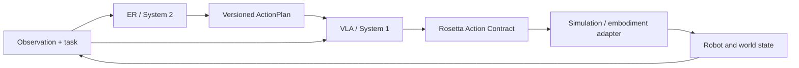
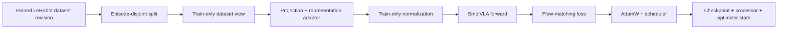
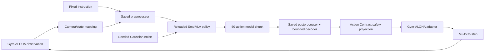
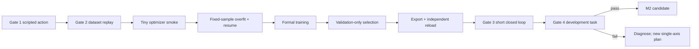

# M2 SmolVLA architecture and navigation

Closed-loop reproducibility diagnostics (2026-09-18):
`diagnose_smolvla_gate.py collect-repro/compare-repro` adds a separately registered
three-arm comparison: two identical boundary observers, then the same observer
plus the existing full trace. `eval/reproducibility_capture.py` records actual
model boundaries/noise, MuJoCo integration state (including warmstart), compiled
model identity and effective runtime settings without changing policy behavior.
`eval/reproducibility.py` verifies bundles and locates the first exact mismatch.
See `docs/m2-smolvla-closed-loop-reproducibility.md`. The draft cannot execute;
real CUDA/rollout parity, uninstrumented parity and physics restoration remain
unmeasured. Formal Gate results and M2 are unchanged.

Seed 3 diagnostic framework (2026-09-17):
`scripts/diagnose_smolvla_gate.py` provides independent plan validation,
single-seed collection, complete-array replay, bounded input probes, historical
training-evidence checks, analysis and verification. The fixed step-5000 Seed 3
protocol is diagnostic-only; formal G4 seeds 1000–1004 and existing results
remain unchanged. New `eval/gate_diagnostic_*` modules wrap the original rollout
and capture actual inputs/noise/full outputs without extra live inference.
`eval.action_metrics` remains available through lazy import so file-only checks
do not import torch or a simulator. The draft registration is intentionally not
executable. See `docs/m2-smolvla-seed3-diagnostics.md` for interfaces and evidence
boundaries. This implementation does not establish real CUDA replay or rollout
parity, a new Seed 3 result, a policy repair, or M2 completion.

Grasp-loss window verification (2026-09-16):
`reports/training/m2-smolvla-gate-grasp-loss-review-2026-09-16.md` separates
world-height change from object motion relative to the palm. Seed 1004's object
translation relative to the palm stays within 0.8 mm over steps 122–125, then
grows around the 126–127 contact-loss window; the step-126 issued aperture is
0.603 versus the previous prediction's unexecuted slot-1 plan of 0.196.
Seed 1002 instead loses reward-2 contact while still commanding closure, with
concurrent palm motion and relative object displacement. Neither window proves
a unique cause; observation and sampled noise both change on replanning.
The read-only analysis covers 4,990 adjacent gripper-plan comparisons, with
independently verified relative-position calculations and no new rollouts.

Primary-agent first-step review (2026-09-16):
`reports/training/m2-smolvla-gate-first-step-review-2026-09-16.md` distinguishes
offline first-action bias from a demonstrated irreversible first-step cause.
In seeds 1000/1001 both palms initially move toward their respective objects
but never establish contact; seed 1002's right palm initially moves slightly
away, then later reapproaches and contacts the peg. Each episode supplies 500
distinct state and top-camera input hashes while replanning. No matched expert
first action or first-step intervention was measured, so the contribution of
initial error to failed grasp establishment/retention remains unresolved.

Traced Gate 005 failure localization (2026-09-16):
`reports/training/m2-smolvla-traced-gate-failure-analysis-2026-09-16.{md,json}`
analyzes the retained 2,500 executed steps without new model/simulation calls.
Seeds 1000/1001 never contact either object; 1003/1004 move the socket but never
contact the peg; 1002 has only three reward-2 steps before losing that progress.
All 27 physical joint-limit counts concern finger joints, and all 60 unexpected
contact counts concern fingers contacting the table. Executed raw/projected/
adapter actions match exactly over 35,000 scalars. Internal gripper support
violations occur in 44/5,000 executed gripper values and are not established as
the common cause. Failed grasp establishment/retention is localized; a unique
learning-side cause and the reason for the 004/005 trajectory difference remain
unresolved. No new training, checkpoint selection or Gate success is implied.

Authorized traced Gate repeat completed (2026-09-16):
`scripts/run_canonical_gate_repeat.py` runs the existing posttrain supervisor
under the new execution namespace `canonical-fullframes-posttrain-20260916-005`.
The immutable attempt-004 scientific plan, step-5000 weights, saved processors,
Gate engine and acceptance criteria remain pinned. The scoped trace observes
each original rollout and independently verifies its persisted events.
84 CPU checks, CUDA doctor, independent full-array reload/native equivalence
and G3 passed. G4 failed 0/5 over five 500-step episodes; maximum rewards were
0/0/2/0/0, with 27 joint-limit violations and 60 unexpected collision counts.
Parameters remained unchanged and optimizer steps were zero. The worker completed
normally in 1135.6245 seconds; 71 returned files passed full size/SHA verification.
See `reports/training/m2-smolvla-traced-gate-result-2026-09-16.md` and its JSON.
M2 remains incomplete. The trajectory difference from attempt 004 has not been
causally attributed; real traced/untraced rollout equivalence remains unmeasured.
Current platform power/billing state was not verified during result retrieval.

Independent rollout diagnostics (2026-09-16):
`scripts/diagnose_canonical_rollout.py` and the `eval/rollout_trace` modules add
create-only prediction/step traces around the unchanged Gate rollout, with
independent gripper-support replay and explicit incomplete evidence. Saved
processors, decoder semantics, noise and actions are unchanged. The interface,
registration and validation boundaries are documented in
`docs/m2-smolvla-rollout-trace.md`. This is instrumentation only: no new model
collection, GPU run or Gate result; canonical step-5000 Gate 4 remains 0/5.
Offline synthetic verification passed 43 new diagnostic tests and 45 related
regressions; one CUDA-only test was skipped. Real traced-rollout parity is unmeasured.

Step2500-to-5000 controlled comparison completed (2026-09-16):
`reports/training/m2-smolvla-visual-process-result-2026-09-16.md` records the
additional1268 forwards at2500, exact common inputs/noise/image identities,
103680 independent metric checks and512 fixed-cohort comparisons. Frame125
left-gripper training fit improves in both fixed exposure cohorts, while
development paired-image gain falls in every episode/noise condition; other
times/action groups improve. No global training-collapse or code-defect claim
is justified. Primary checkpoint stays5000 and its prior G4 remains0/5. Local
SHA verification covered16 returned files; fresh Chrome state confirmed the
instance off at10:56:54 China time, before the11:02 cap. No further GPU work
or formal training is launched. The following entries retain earlier findings.

Saved-array timing exploration completed (2026-09-16):
`reports/training/m2-smolvla-visual-timing-result-2026-09-16.md` separates
frame125 scene-dependent command timing from frame250 low-aperture amplitude
errors. Episodes13/33 account for88.5%–93.1% of development frame125 squared
error with opposite crossing directions. Train-only bias subtraction reduces
frame0 joint first-action error but remains worse than both constant baselines
in every noise condition. This is post-hoc CPU evidence, not a deployed repair.
All45 episodes remain in360 gripper and2160 joint records plus18000 trace rows;
independent numerical replay and prior-metric reconciliation passed. No model,
SSH, GPU, training or Gate call occurred in this stage. Step2500 paired sampling
remains unmeasured; no new training defect or M2 success is established.

Step-5000 paired visual collection completed (2026-09-16):
`reports/training/m2-smolvla-visual-paired-result-2026-09-16.{md,json}` records
1268 forwards, zero updates, eight exact self-copy controls and four exact full
chunk matches against overlapping native endpoint samples. Independent replay
checked 51,840 per-episode metrics and 1280 decomposition values; 19 returned files
passed SHA checks. Frame-0 full chunks show positive image correspondence in all
four noise conditions, but development joint actions remain worse than aligned
constant baselines, especially the executed first action. Later left-gripper
results expose timing/development weaknesses. No new training defect or Gate
success is established; step2500 remains unmeasured. Protected shutdown followed
local backup verification; fresh Chrome state confirmed the instance powered off.
The 10:15 backup shutdown timer remains because automatic review rejected its
cancellation. No release, retraining or checkpoint selection occurred.

Input-exposure reporting repair 008 (2026-09-15):
`reports/training/m2-smolvla-input-exposure-repair-2026-09-15.md` explains why
83/160 seen main-grid inputs at step 2500 is expected under the half-epoch
schedule. The analyzer now splits current seen/unseen error and preserves fixed
step-2500 cohorts across checkpoints, without changing image or baseline donors.
Training/sampling remain unchanged. After restoration of the no-card SSH, all
16 CPU tests, Ruff and the original 83/77 coverage check passed. The old reporting
counterexample was reproduced; original aggregate metrics remain equal.

Data-first visual research, no-card stage (2026-09-15):
`reports/training/m2-smolvla-visual-research-result-2026-09-15.{md,json}` and
`docs/m2-smolvla-visual-research.md` document the new plan/stage/output entrypoint,
complete numeric arrays, precise row provenance and checkpoint exposure flags.
22,500 packet timestamps and 135 independent decoded-image hashes passed; raw
labels, projected labels and all negative supervision results remain available.
Step 2500 had seen only 83/160 main-grid training inputs despite supervision of
19,962 unique target frames; step 5000 consumed all 20,000 input identities once.
Final CPU QA: 12 tests and Ruff passed, independent arithmetic replay passed.
The expanded AST inventory is not a blanket semantic correctness claim. Physical
alignment remains unproven. At closure of this no-card stage, paired collection
was unmeasured and its CPU-only plans rejected model collection before weight
access; the separately authorized 2026-09-16 result is recorded above. No new Gate or M2
success. Owners: `scripts/diagnose_smolvla_visual_research.py`,
`scripts/visual_research_data.py`, `scripts/visual_research_collect.py`,
`scripts/verify_visual_research.py`, and `vla/visual_research.py`.

Canonical full-frame Gate closure (2026-09-15):
`reports/training/m2-smolvla-canonical-fullframes-gate34-result-2026-09-15.{md,json}`
records attempt 004: exact new-artifact/native reload and adapter chunks, unchanged
parameters, Gate 3 passed, and measured Gate 4 **0/5** over five 500-step episodes.
Physical joint-limit/contact counts were 19/38; command-action checks passed.
All 47 returned files were independently SHA-verified and platform shutdown was
confirmed. Attempts 002/003 were preserved precondition failures, not Gate 4
measurements. The launcher now keeps live logs under runs to preserve code identity;
output and Trackio roots are initialized together. M2 remains incomplete.

Fresh full-frame furnace completed (2026-09-14):
`reports/training/m2-smolvla-canonical-fullframes-plan-2026-09-14.md` and
`canonical-furnace-template-20260914-002.json` register
`canonical-fullframes-20260914-001`, 5000 fresh updates at batch 4, one sealed
20000-frame training pass, canonical pixels and complete checkpoints at 2500/5000.
The existing bounded temporal CLI mode is named smoke; this run is explicitly
5000 updates, not a two-step smoke or tested formal resume. New composition QA
passed 98 tests before dispatch. All nine worker stages exited zero; 20000 unique
training inputs were consumed once, and complete 2500/5000 checkpoints were
recovered and verified locally. Original and new-artifact independent reload passed;
the later offline/Gate closure above is negative. Owners: `scripts/canonical_furnace.py` (plan and real-input
training audit) and `scripts/run_canonical_furnace.py` (bounded lifecycle).

Canonical post-training repair 002 uses one saved-processor loader for collection,
offline evaluation and the original Gate engine. A candidate artifact cannot become
verified until two new processes reproduce full arrays and the recovered native
endpoint. Rendered Gate YAML and prerequisites are sealed before execution, with
an independent shutdown watchdog. CPU repair QA passed 37 tests and real endpoint
metadata/file-seal checks without loading weights. Follow-up lifecycle repairs
expanded QA to 41 tests before completed attempt 004. See
`reports/training/m2-smolvla-canonical-posttrain-repair-2026-09-14.md` and
`m2-smolvla-canonical-fullframes-posttrain-gate-plan-002-2026-09-14.json`.

Latest canonical CUDA verification (2026-09-14):
`reports/training/m2-smolvla-training-chain-canonical-result-2026-09-14.{md,json}`
records run 007: all nine stages passed, 105 regression tests passed including
exhaustive CUDA pixel parity, and 40 handoff members verified after retrieval.
At episode 49 frames 0/249/499, canonical CUDA input and independent CPU division
produce exactly equal real loss, all 155 gradient tensors and complete actions.
Two fresh-base updates consumed eight unique input frames / 300 unique targets;
345 frozen tensors stayed unchanged. Two distinct model reload processes each
ran 16 forwards with exact full-array equality. This closes the bounded canonical
GPU check below, not full training, formal resume, generalization or M2.

Previous GPU continuation (2026-09-14):
`reports/training/m2-smolvla-training-chain-gpu-continuation-result-2026-09-14.{md,json}`
records run 006: two actual updates, eight unique input frames, 302 valid action
slots / 300 unique targets, 345 frozen tensors unchanged, independent full-array
model reload, and fixed Iris 1280-step control Gate 3 pass / Gate 4 0/5.
The new two-step policy has no Gate success claim. Run 006's complete checkpoint
was backed up and verified before user-authorized remote cleanup. M2 remains open.

Canonical RGB execution repair (2026-09-14, CPU and bounded GPU checks passed):
`src/rosetta_reality/vla/image_scaling.py` and opt-in v2 feature
`canonical_image_scaling` bind RGB bytes to one float32 lookup table on CPU/CUDA.
Native Accelerate training previously divided CUDA uint8 by 255, while offline
inference divided on CPU. Real nonzero-frame probes measured up to 5.96e-8 pixel
and 0.0399323 normalized-action differences; frame-zero alone missed the effect.
The feature preserves original bytes/metadata and prevents the native loop from
scaling twice. New checkpoint sidecars record the recipe. Historical plans stay
unchanged; verification scope is amendment-009, not a formal training repair result.

Earlier GPU follow-up, before run 006 (2026-09-14):
`reports/training/m2-smolvla-training-chain-gpu-result-2026-09-14.{md,json}`
records exact native-versus-masked-camera-skip CUDA loss, all 155 gradient
tensors and full action parity at episode 49 frames 0/249/499, with unchanged
parameters. Three new diagnostic harness failures are retained; total successful
optimizer updates remain zero. The latest hook observes frame metadata before
the native processor, then checks tensors at policy ingress; GPU validation of
that hook, two-step smoke, independent model reload and fixed Gate rerun remain
pending because the original host has no free GPU. Reload array identity now
supports explicit 32-wide noise alongside 14-wide actions; no truncation.
No new Gate result, model selection or M2 completion is claimed.

Repaired-chain SSH verification (2026-09-14):
`reports/training/m2-smolvla-training-chain-ssh-result-2026-09-14.{md,json}`
records 569 CPU regressions plus 30 Gate contract tests passing on the original
AutoDL instance in no-card mode. All 22,500 nonhidden numeric rows, eight real
temporal loader/video samples and both saved processor boundaries passed their
bounded checks. A fresh workspace required original-SHA prerequisite binding;
the failed initial attempt remains preserved. Actual 450M CUDA forward/backward,
independent model reload and new policy Gates remain unmeasured because the
original GPU was unavailable. CPU/tensor/contract checks do not establish M2.

Training-chain follow-up repairs completed (2026-09-14):
`reports/training/m2-smolvla-training-chain-repair-2026-09-14.{md,json}`
records the new checkpoint selector and full-array evidence verifier documented
in `docs/m2-smolvla-posttrain-v2.md`. Exact historical source fixtures repair
test setup while production source-pin checks remain strict. Final related
regression: 569 passed, zero failures, one CUDA skip and two data deselections.
Separate cached-data verification decoded all 22,500 nonhidden frame samples
and checked their complete 50-by-14 target chunks against independent raw reads.
Independent video timestamp/physical semantics, actual full-model reload and
formal resume remain unverified. Two historical vcdropout source versions remain
unavailable locally; its synthetic gate tests do not reproduce that old run.
This supersedes the eight test failures and sampled-only image coverage below;
frozen historical hashes, prior results and Gate/M2 conclusions remain intact.

Training/data rescan completed with retained limits (2026-09-14):
`reports/training/m2-smolvla-training-chain-rescan-2026-09-14.{md,json}`
records six repaired declaration/execution gaps and 16 reproduced counterexamples.
The v2 schema now requires the action boundary and installed learning contracts,
rejects ignored overlays, validates smoke identities and preserves checkpoint saves;
explicit schedules reject unauthorized drafts. Final regression: 512 passed,
eight retained historical source-pin failures. Full train/dev numeric checks,
405 complete action chunks, train-only statistics and saved processor execution
passed. Native temporal loader/update/observer integration passed on tiny CPU
policies; full model/CUDA/resume and full image verification remain unmeasured.
This supersedes only the paused audit's resolved items below, not historical Gates.

Local training-chain audit paused for user battery limit (2026-09-14):
`reports/training/m2-smolvla-training-chain-local-audit-2026-09-14.md` records
confirmed source-identity, teardown, declaration, split, mask and diagnostic
repairs. 20,000 train and 2,500 development numeric frames plus 405 temporal
image/chunk samples were checked locally; hidden rows were not materialized.
The broad suite had 480 passes and 9 failures (one registry expectation since
corrected, eight historical source-pin failures retained). Final AST/Ruff passed;
final ML rerun, saved-processor statistics, complete temporal launch integration
and the full semantic audit remain incomplete. No new policy training or Gates.
New executions must reseal implementation identities; historical pins stay fixed.


Latest completed policy Gates: Iris 002 (closure 2026-09-14).
`reports/training/m2-smolvla-iris-gate34-result-2026-09-14.{md,json}` records
control/treatment suffixes 451/452: both Gate 3 passed, both Gate 4 failed 0/5,
maximum reward 0 on all ten 500-step episodes. Safety counts were zero; only
task success failed. All 5040 closed-loop actions plus eight bridge inferences
used unchanged weights (zero optimizer). 46 evidence files and independent
report/binding/arithmetic checks passed; platform shutdown was observed.
Earlier pending Gate statements below are superseded. M2 remains incomplete.

Iris Gate state-contract correction (2026-09-13):
`reports/training/m2-smolvla-iris-gate34-recovery-003-2026-09-13.md` records
attempt 002 stopping before inference on the upstream config's placeholder
state dimension. The wrapper now uses the original engine's dataset-state and
action-contract helpers; 52 relevant local checks passed. Attempt 003 preserves
the same two checkpoints and all thresholds. No Gate outcome is claimed yet.

Iris Gate runtime correction (2026-09-13):
`reports/training/m2-smolvla-iris-gate34-recovery-002-2026-09-13.md` preserves
the first attempt's pre-inference data-root identity failure (21 files recovered,
shutdown confirmed). Native data loading now temporarily uses the durable run
root and restores the isolated Gate output root. 51 relevant local tests passed;
fresh Gate identity 002 is registered with unchanged checkpoints and thresholds.
No actual Gate pass/fail outcome exists yet; M2 remains incomplete.

Iris 002 Gate 3/4 registration (2026-09-13):
`reports/training/m2-smolvla-iris-gate34-plan-2026-09-13.md` registers the two
fixed 1280-step artifacts under report suffixes 451/452, with zero optimizer
updates and the unchanged simulation engine. `scripts/iris_gate.py` owns the
saved-processor adapter/identity checks; `scripts/run_iris_gate.py` owns the
guarded lifecycle. 49 relevant local tests passed; CUDA Gates remain pending.
The previous offline negative result remains authoritative; M2 is incomplete.

Iris 002 completed result (2026-09-13):
`reports/training/m2-smolvla-iris-result-002-2026-09-13.{md,json}` records both
fresh 1280-step arms plus separate smokes (2564 updates total). All 27 stages,
saved-processor independent reloads, 125-file recovery and local numeric checks
passed; the console confirmed protected shutdown. Both arms fit train40 4/4,
but development acceptance failed. Image K scene regularization reduced full
left-joint MAE/MSE by 1.04%/2.21% averaged across four noises, still worse than
train-only constant baselines. No new Gate 3/4; M2 remains incomplete.

Iris CUDA smoke result (2026-09-13):
`reports/training/m2-smolvla-iris-smoke-failure-2026-09-13.{md,json}` records
passed calibration/control smoke/reload, then a treatment metric-name rejection.
Control/treatment executed 2/1 optimizer steps; main training did not start.
49 evidence files passed SHA verification and the console confirmed shutdown.
Metric names now use `image_k_scene_*`; the public sanitizer is unchanged and
118 local checks passed. The repair has not run on CUDA. Preserve the failed
run/template; a fresh registered identity is needed before further execution.
M2 remains incomplete, with no new Gate 3/4 result.

Iris furnace pipeline module (2026-09-13):
`reports/training/m2-smolvla-iris-furnace-local-2026-09-13.{md,json}` records
117 local tests plus Ruff, formatting and shell syntax checks. `iris_protocol.py`,
`iris_calibration.py`, `iris_stage.py`, `run_iris_furnace.py`, `iris_delivery.py`
and `analyze_iris.py` now own the guarded two-arm pipeline and sealed handoff.
This supersedes the local implementation pending items below. CUDA admission,
calibration and training remain unmeasured; the worker awaits the user SSH window.
No Iris optimizer step or new Gate 3/4 result exists; M2 remains incomplete.

Iris local repair module (2026-09-13):
`reports/training/m2-smolvla-iris-local-repair-2026-09-13.{md,json}` records
91 synthetic/container checks plus Ruff and formatting. The opt-in
`image_key_regularization.py` feature and `scripts/iris_runtime.py` own the
training regularizer and sealed checkpoint/evaluation boundaries. Calibration,
the complete two-arm supervisor and live CUDA admission remain pending;
Iris is not launchable, no training started, and M2/Gate status is unchanged.

Latest completed Hestia Q replay (2026-09-13):
`reports/training/m2-smolvla-hestia-q-replay-result-2026-09-13.{md,json}` records
2160 forwards, zero optimizer, 1800 exact controls and 336 verified returned files.
Fixed native Q retains 91.92%/86.80% of the measured 640/1280 K-mean left-joint
MAE benefit; natural Q feedback further enhances it. Independent action arithmetic
(148224 scalars), replay identities (172800 events) and saved CUDA tensor hashes
(1920) passed. The extra float64/BF16 one-ULP numerical check FAILED and remains
unrelaxed; the full verification chain must not be called passed. The instance was
observed off in Chrome. Owners are the `hestia_q_replay` modules under `scripts/`.
The next experimental K-scene regularization design is explicitly non-launchable
in `m2-smolvla-hestia-k-scene-regularization-design-2026-09-13.{md,json}` under the
same reports directory. Policy repair, unique underlying cause and new Gate passes
remain unproven; no new training or checkpoint selection occurred.

Latest completed Hestia scene K/V diagnosis (2026-09-13):
`reports/training/m2-smolvla-hestia-scene-kv-result-2026-09-13.{md,json}`
records 1800 CUDA forwards, 720 exact controls, 54 returned files, 459456
independent scalar checks and 7200 projection-identity checks. At 640, image
K-mean improves left-joint MAE from 0.058508 to 0.050983 and strengthens correct
scene covariance; V-mean worsens MSE under three noises, and removing V after
K makes both metrics worse under all four noises. Early evidence now favors
K-side scene dependence/query-key matching, while historical late V-update harm
remains valid. No strict offline candidate or new Gate passes; M2 is incomplete.
The platform was observed off. This completed result supersedes the pending
execution statements and tentative early V prioritization below.

Latest Hestia root-evidence audit (2026-09-13):
`reports/training/m2-smolvla-hestia-root-evidence-result-2026-09-13.{md,json}`
recomputes both fixed-remainder K/V factorial tables from saved CUDA arrays.
Both parameter groups contribute to measured late left-joint regression; V is
larger on the full dev5 cohort, with scene-removal exceptions. The 640 left-joint
gap is 77.42% of the final gap to the better train constant; joint K/V rollback
removes only 16.88% of that final gap. These are different denominators from
late-regression recovery rates, not unique causal shares. Owner:
`scripts/analyze_hestia_root_evidence.py`; 52 source files, 192 historical
metric groups and nine synthetic tests verified. No new model forward, SSH,
optimizer, checkpoint selection or Gate ran. Early root cause remains unresolved.

Next scientific design:
`reports/training/m2-smolvla-hestia-scene-kv-ablation-design-2026-09-13.{md,json}`
specifies same-checkpoint image K/V mean ablations with native/self-copy controls.
It is non-launchable: implementation, source/cache seals and current CUDA runtime
checks remain pending. No execution or new result is implied by this design.

The implementation now passed 161 offline tests and is separately registered in
`reports/training/m2-smolvla-hestia-scene-kv-plan-2026-09-13.md` and its template.
`scripts/hestia_scene_kv.py` owns train-only K/V calibration and image-slice hooks;
the new collector/supervisor retains exact controls, identity and shutdown gates.
CUDA controls and scientific results remain pending until the new run completes.

This is the stable architecture and navigation entry point for the current
SmolVLA M2 work. It is intentionally not named after a furnace or date. Update
this file when component ownership, execution boundaries, the current evidence
source, or the next repair stage changes.

Document updated: 2026-09-12. Current Faust evidence snapshot: 2026-08-12;
current Aster implementation audit: 2026-08-13; current Way CUDA evidence:
2026-08-14; current object-geometry teacher/official planner evidence:
2026-08-16; current Zen two-arm campaign completion audit: 2026-08-27; current
visual-conditioning furnace execution and gradient-gate pass: 2026-08-28;
current vcdropout Gate 3/4 registered comparison: 2026-08-29; current T2
teacher-gate candidate closures (scripted adapter, geometric command layer):
2026-08-30 / 2026-09-02; latest policy Gate 3/4 closure: 2026-09-06;
Hestia main-run recovery: 2026-09-11; CUDA curve, local error localization,
scene/phase, commanded-pose and readout-family diagnostics: 2026-09-12.

## 1. Mandatory reading order and authority

Before changing SmolVLA data, processors, trainers, optimizers, checkpoints,
exports, evaluation or simulation, read in this order:

1. `AGENTS.md` — safety, runtime, stage-gate and repository rules;
2. this file — stable component, control-flow and evidence map;
3. `reports/training/m2-smolvla-faust-trainer-optimizer-audit-2026-08-12.md`
   — Faust empirical interpretation and original repair framework;
4. `reports/training/m2-smolvla-faust-trainer-optimizer-audit-2026-08-12.json`
   — machine-readable result and finding registry;
5. `reports/training/m2-smolvla-zen-formal-audit-2026-08-27.md` and its JSON
   companion — the historical two-arm Zen campaign and its
   Gate 4 negative results, superseding nothing above but extending the
   failure tally and next-step options; the follow-up diagnostic is
   preregistered in
   `reports/training/m2-smolvla-zen-first-deviation-preregistration-2026-08-28.md`
   and its JSON companion;
6. for object-geometry work,
   `reports/training/m2-smolvla-geometry-teacher-audit-2026-08-14.md` and its
   JSON companion, then
   `reports/training/m2-smolvla-mink-ik-audit-2026-08-15.md` and its JSON
   companion, then
   `reports/training/m2-smolvla-moveit-path-planner-preregistration-2026-08-15.md`
   and its JSON companion, then
   `reports/training/m2-smolvla-moveit-runtime-boundary-preregistration-2026-08-15.md`
   and its JSON companion, then
   `reports/training/m2-smolvla-moveit-joint-path-margin-preregistration-2026-08-15.md`,
   `reports/training/m2-smolvla-athena-plan026-exact-audit-2026-08-15.md`,
   `reports/training/m2-smolvla-execution-margin-diagnostic-preregistration-2026-08-15.md`,
   `reports/training/m2-smolvla-athena-plan027-exact-audit-2026-08-15.md`, and
   `reports/training/m2-smolvla-execution-reserve-preregistration-2026-08-15.md`,
   then `reports/training/m2-smolvla-athena-plan028-exact-audit-2026-08-15.md`,
   then
   `reports/training/m2-smolvla-moveit-start-path-constraint-recovery-preregistration-2026-08-15.md`,
   then `reports/training/m2-smolvla-athena-plan030-exact-audit-2026-08-15.md`,
   then
   `reports/training/m2-smolvla-moveit-hybrid-trajectory-execution-preregistration-2026-08-15.md`
   then `reports/training/m2-smolvla-athena-plan032-exact-audit-2026-08-15.md`,
   then
   `reports/training/m2-smolvla-mujoco-position-feedforward-preregistration-2026-08-15.md`
   then
   `reports/training/m2-smolvla-athena-plan033-local-exact-audit-2026-08-15.md`,
   then
   `reports/training/m2-smolvla-mujoco-sparse-actuator-moment-repair-preregistration-2026-08-15.md`
   then
   `reports/training/m2-smolvla-athena-plan034-local-exact-audit-2026-08-15.md`,
   then
   `reports/training/m2-smolvla-gym-joint-name-adapter-repair-preregistration-2026-08-15.md`
   then
   `reports/training/m2-smolvla-athena-plan035-local-exact-audit-2026-08-15.md`
   with their JSON companions, then the immutable Plan `050`--`054` exact
   audits ending at
   `reports/training/m2-smolvla-athena-plan054-local-exact-audit-2026-08-16.md`,
   its JSON companion, the Athena remote exact reproduction at
   `reports/training/m2-smolvla-athena-plan054-remote-exact-audit-2026-08-16.md`
   and its JSON companion, then the repaired content-addressed Athena package
   report at
   `reports/training/m2-smolvla-athena-plan054-workspace-package-repair-2026-08-16.md`
   and its JSON companion, then the authorized local repair-chain audits
   `m2-smolvla-athena-plan055-local-exact-audit-2026-08-16`,
   `m2-smolvla-athena-plan056-local-exact-audit-2026-08-16`,
   `m2-smolvla-athena-plan057-local-exact-audit-2026-08-16`, and
   `m2-smolvla-athena-plan058-local-exact-audit-2026-08-16` with their JSON
   companions;
7. the registered experiment, formal-run and simulation configs named below;
8. immutable `runs/` and `artifacts/` evidence referenced by those reports;
9. implementation code and tests for the component being changed.

For the current Hestia line, also read
`reports/training/m2-smolvla-hestia-main-recovery-result-2026-09-11.{md,json}`,
then `reports/training/m2-smolvla-hestia-cuda-checkpoint-curve-closure-2026-09-12.{md,json}`
then `reports/training/m2-smolvla-hestia-checkpoint-localization-result-2026-09-12.{md,json}`
then `reports/training/m2-smolvla-hestia-scene-phase-result-2026-09-12.{md,json}`
then `reports/training/m2-smolvla-hestia-command-pose-result-2026-09-12.{md,json}`
then `reports/training/m2-smolvla-hestia-pose-readout-result-2026-09-12.{md,json}`
and `reports/training/m2-smolvla-hestia-phase-bridge-result-2026-09-12.{md,json}`.
The subsequent local weight check is
`reports/training/m2-smolvla-hestia-projection-spectrum-result-2026-09-12.{md,json}`.
The native collection and latest readouts are now completed in
`reports/training/m2-smolvla-hestia-prefix-path-closure-2026-09-12.{md,json}` and
`reports/training/m2-smolvla-hestia-prefix-readout-result-2026-09-12.{md,json}`.
The September 11 local closure and retrieval plan are earlier stages, now completed.
The latest completed policy Gate 3/4
authority remains `reports/training/m2-smolvla-vfunfreeze-gate34-closure-2026-09-06.{md,json}`.
Earlier plans and stage-local pending statements below are historical context;
they do not override the completed results or authorize another dispatch.

Authority is layered rather than interchangeable:

| Question | Source of truth |
|---|---|
| What is allowed and where may it run? | `AGENTS.md` |
| Which component owns a behavior? | this architecture document plus executable code |
| What was preregistered for a run? | the hash-bound config for that run |
| What physical action semantics apply? | `configs/sim/aloha_insertion_smolvla.yaml` |
| What actually completed? | immutable machine-readable evidence under `runs/` and `artifacts/` |
| Why did the result pass or fail? | the current audit Markdown and JSON |

If prose conflicts with a hash-bound config, Action Contract, code assertion or
evidence file, stop and reconcile the mismatch. Do not silently select the
convenient source. Historical reports remain provenance and must not be edited
to make a later result appear successful.

## 2. Current M2 status

The current work line is **VLA / System 1**, not Qwen ER.

Latest Hestia phase-mechanism bridge (2026-09-12):
`reports/training/m2-smolvla-hestia-phase-bridge-result-2026-09-12.{md,json}`
tests native C's own left-opening event against the true event and restores
phase-domain readouts to the same original 50-slot targets. Event-aligned
native left orientation remains 0.154977 rad versus the better equally
phase-informed constant at 0.136225; every noise fails both constants.
Even true-event reconstruction fails the joint full-action comparison. A
single left-opening phase is therefore insufficient, without ruling out all
temporal mechanisms. Seventeen synthetic checks and 764 independently
recomputed fields passed; no model forward, raw-row load or SSH ran.
Owner: `scripts/diagnose_hestia_phase_bridge.py`. Root-cause work remains
ongoing. The subsequent native prefix collection is complete: 180 normalized
and standard outputs exactly reproduce C, 500 parameter hashes are unchanged,
and 45 unpooled prefix files passed transfer verification. Its 155.672-second
worker ran 0 optimizer steps. A matching shutdown receipt was delivered and SSH
then closed; platform power/billing was not independently measured.

The eight fixed layer-1/15, input/projected, mean/2x2 readouts all beat both
object-position constants in train outer holdouts and development. Neither
onset beats both constants in train holdouts, and no arm jointly improves all
development action groups. Fourteen relevant synthetic/FK checks and 4,704
independently recomputed fields passed. This refutes complete object-position
erasure at the inspected projections, not every representation limitation.
Owners: `scripts/diagnose_hestia_prefix_path.py` and
`scripts/diagnose_hestia_prefix_readout.py`. No causal parameter intervention,
policy repair, checkpoint selection or new Gate has run.

The next reciprocal K/V substitution is prepared in
`reports/training/m2-smolvla-hestia-parameter-crossover-preparation-2026-09-12.{md,json}`.
A 500-tensor byte audit finds all 345 frozen VLM tensors identical at 640/1280;
16 cross-attention K/V and 106 other tensors changed. Four fixed conditions
will require exact endpoints before either hybrid, with no optimizer. This
tests the later regression and cannot alone explain both endpoints' failures.
The first original-card dispatch has now occurred, but failed in admission before
any model forward. The registered experiment remains 720 forwards, no optimizer
and the same protected shutdown window. This preparation is superseded by the completed crossover, split and layer results below.
The subsequent dispatch attempt was blocked by automatic approval review,
including a reduced 14-file, 2,447,360-byte payload. No transfer or inference
ran; the idle window entered the existing protected shutdown and SSH closed.
The user subsequently authorized that concrete payload to the specified SSH
destination and provided no-card access. Staging is now complete: an interrupted
partial array was preserved and the two arrays were restored from SHA-identical
originals on the same host. All 79 source/input/checkpoint/upstream/normalization
identities matched and 34 CPU tests passed; four evidence files were recovered
and verified. No policy was constructed or run in that preparation. Workspace
`20260912T102718Z-bd007f5402bf-c3091a190b62` now preserves the failed 001 run;
do not rerun or modify its registered code. The preparation authority is
`reports/training/m2-smolvla-hestia-parameter-crossover-nocard-preflight-2026-09-12.{md,json}`.
Earlier authorization context is in
`reports/training/m2-smolvla-hestia-parameter-crossover-transfer-authorization-2026-09-12.md`.
The earlier rejection remains historical evidence in
`reports/training/m2-smolvla-hestia-parameter-crossover-dispatch-blocked-2026-09-12.{md,json}`.

Latest execution status:
`reports/training/m2-smolvla-hestia-parameter-crossover-first-attempt-2026-09-12.{md,json}`.
Doctor, normalization and CPU checks returned 0. Worker exited after 27.966 seconds
because the CLI passed a string profile path to the Path-only file-hash helper;
template filenames had the same defect. No condition reached model loading.
Retrieval found SSH closed and produced an empty archive, so the full failure
bundle and shutdown wrapper record still need recovery. Do not claim billing state.
The unchanged old collector reproduces this error in a new CLI test. Versioned
002 fixes only the two path conversions and changes its run ID; all four synthetic
CLI paths, tampering rejection and no-card rejection now pass, 43 tests total.
The six-file, 71,680-byte repair package has 59 registered scientific identities.
The existing workspace is reused as a read-only base for a fresh repair identity,
without retransmitting the original 14-file payload. Restore old results first,
then dispatch the correction under `parameter-crossover-v2-plan/template`.
Receiver connection is now prepared before launch, rather than after worker exit.
Actual corrected CUDA execution remains not measured; this implementation defect
is not a root cause of Hestia's visual generalization failure.

Subsequent no-card recovery is recorded in
`reports/training/m2-smolvla-hestia-parameter-crossover-v2-nocard-preflight-2026-09-12.md`.
All seven old failure files and the separate old shutdown request are now recovered
and hash-verified. The six-file repair was staged into fresh workspace identity
`20260912T113534Z-bd007f5402bf-1cd3c7fc0c28`; all 84 identities and 43 CPU tests passed.
Reuse this new workspace for the registered CUDA correction. No new normalization
binding, model loading, inference, shutdown or instance release occurred in this
no-card recovery. The earlier empty receiver and failed workspace remain preserved.

Latest completed causal evidence supersedes the pending GPU status above:
`reports/training/m2-smolvla-hestia-parameter-crossover-result-2026-09-12.{md,json}`.
Corrected 002 completed all 720 forwards in 560.374 seconds. Both 180-forward native
endpoints reproduced exactly; each hybrid changed only the registered 16 K/V tensors.
All 22 files are recovered and the matching receipt was sent. K/V updates have
bidirectional causal contributions to seven full-trajectory development regressions
under all four noises. Older K/V recover 74.7% of left-joint regression; newer K/V
recreate 89.7% reciprocally, dominated by episode 13 and left wrist angle. Hybrids
still fail joint/gripper/orientation constant baselines, and first-action effects
differ. This is partial causal localization, not a complete generalization root cause.
Independent local verification checked 28,992 fields. The 002 shutdown request was
not retrieved; a closed SSH connection is not independent billing confirmation.

Next registered axis: `m2-smolvla-hestia-kv-split-plan/template-2026-09-12` with
`scripts/hestia_kv_split.py`, `scripts/diagnose_hestia_kv_split.py`, and
`scripts/run_hestia_kv_split.py`. Six conditions retain both fresh exact endpoints
and add K-only/V-only reciprocal substitutions of eight tensors each. 69 local
checks passed; nine-file delta is prepared, not uploaded or executed. Registration
allows 1080 forwards, zero optimizer, 1200-second work and 1500-second protected
shutdown limits, subject to the next authorized CUDA window. No Gate status changed.

The K-only/V-only split is now completed; see
`reports/training/m2-smolvla-hestia-kv-split-result-2026-09-12.{md,json}`.
All 1080 forwards completed in 825.581 seconds. Both native endpoints reproduce
exactly; each intervention changes exactly eight registered tensors. All 30 files
are recovered and independently verified. V-only left-joint recovery/damage is
59.1%/69.7%, versus K-only 19.5%/13.8%. K and V both contribute; K's newer weights
improve left commanded position, so no blanket K-failure claim is supported.
V-only hybrids still fail relevant constants. All 69,440 independent numeric
checks passed, including cross-run paired arrays and K/V nonadditivity.
The current shutdown request and matching receipt were recovered. Earlier
crossover 002 shutdown evidence was also recovered in the separate
`parameter-crossover-shutdown-recovery-2026-09-12.json` report. Billing is not
independently verified; no instance release was requested.

The per-layer V test is completed: eighteen conditions, 3240 forwards, zero optimizer,
78 verified files, and 193,664 independently recomputed scalar fields. See
`reports/training/m2-smolvla-hestia-v-layer-result-2026-09-12.{md,json}`.
Seven of eight layers contribute bidirectionally to left-joint late regression under
all four noises. Layer 7 has the largest individual left/right joint recovery, but
only recovers 17.52% of left-joint regression. Scene covariance and global bias both
contribute; gripper timing and full-action generalization remain unsuccessful.
The shutdown request and matching receipt have since been recovered; see the
separate v-layer-shutdown-recovery report. The matched instance was observed off
and subsequently restarted for the user's authorized continuing diagnosis.
The first value-component attempt failed before a completed forward because its
observer confused the 64 real-camera token slice with the complete prefix. All
eight failure files are preserved. Pinned upstream source confirms 241 prefix
positions: 3 x 64 image, 48 language, and one trainable state-projection token.
The value-route plan passed 150 local checks and completed ten guarded conditions
to separate exact V-output substitutions by image/language/state positions. These
are contextual token routes, not pure modality-isolated features.

The V-route diagnostic has completed all ten conditions (1800 forwards), with all
50 files verified and 95,744 independent scalar checks passed. Both native and
full-V positive controls are exact. Image-position V updates recover 47.7% of
left-joint late regression and cause 50.8% reciprocal damage; language contributes
13.1%/9.4%, state 1.4%/3.4%. This is route-localized causality, not a unique root or
successful generalization. See `m2-smolvla-hestia-value-route-result-2026-09-12`.
The image-value-component diagnostic completed all ten conditions (1195.953 s):
1800 forwards, zero optimizer, 152 local checks and 85 identity checks. It keeps
the complete 241-position CUDA GEMM and alters only the real-image 64-position
slice, separating train-only global mean, shared token pattern and scene residual.
Native and complete-image positive controls exactly reproduced all 720 saved outputs. All 52 files were verified; 95,744 independent scalar checks passed. The shared image-V offset accounts for 35.9% recovery / 33.8% reciprocal damage of left-joint late regression. Scene residual updates are beneficial for right joints and both grippers. The generalization gap already present at step 640 remains unexplained. See `reports/training/m2-smolvla-hestia-image-value-component-result-2026-09-12.{md,json}`. The provider console shows the instance off; the newest shutdown-request remains to be recovered in the next authorized window. Tonight is closed; resume from `reports/training/m2-smolvla-hestia-next-session-handoff-2026-09-12.md`.

While waiting for current SSH, the local projection-spectrum check
(`reports/training/m2-smolvla-hestia-projection-spectrum-result-2026-09-12.{md,json}`)
read only the four layer-1/15 K/V matrices at 640 and 1280. All eight have
float64 numerical rank 320/320; three condition numbers improve and one grows
by 10%, with unchanged counts below 1% of the largest singular value. No new
rank collapse was found in these matrices. This does not establish BF16
information preservation or correct attention routing. Five synthetic checks,
SVD/Frobenius identities and spectrum reload passed; no model was constructed
or run. Owner: `scripts/diagnose_hestia_projection_spectrum.py`. The native
collection has since completed as recorded above; the root-cause goal remains open.

Preceding Hestia pose/readout-family check (2026-09-12):
`reports/training/m2-smolvla-hestia-pose-readout-result-2026-09-12.{md,json}`
keeps the same initial two-object coordinates and replaces 3-NN with quadratic
ridge, using outer train leave-one-out and train-only inner alpha selection.
Under the true-phase oracle, both arms' orientation beats both constants and
3-NN in train holdouts and development; left development error is 0.114397 rad
versus 0.160336 for 3-NN and 0.134469 for the better constant. The earlier
neighbor orientation deficit is therefore readout-dependent, not proof of
unreadable geometry. Onset prediction still fails the train-holdout constants,
and original-clock full-chunk actions fail to improve all groups. Native
640-to-1280 FK separately shows worse full-chunk orientation in both arms but
better right-palm position; episode 13 dominates left-orientation regression.
No oracle was deployed or checkpoint selected. Fourteen synthetic checks,
48 historical pose metrics and 288 independently recomputed metrics passed.
Owner: `scripts/diagnose_hestia_pose_readout.py`. The next gap is converting
conditional pose correspondence into clock-time actions using observable phase;
no model forward, raw-row load, optimizer, SSH or new Gate ran.

Preceding Hestia commanded-pose check (2026-09-12):
`reports/training/m2-smolvla-hestia-command-pose-result-2026-09-12.{md,json}`
uses native Gym-ALOHA FK on the unchanged clock/event-oracle arrays. Under the
event oracle, fixed geometric neighbors improve development left-palm position
error by 24.4% versus the best joint-constant reference, but orientation remains
19.2% worse. Averaging poses directly preserves this difference. Episode 45
dominates the orientation deficit; episode 13 improves in both pose quantities
for this neighbor predictor. This is distinct from native C checkpoint regression.
Joint-angle errors alone therefore do not locate physical-pose errors, while
converting labels to task space alone has not repaired the measured deficit.
These are commanded, not achieved, poses; true query phases remain nondeployable.
Eight synthetic checks, native chain/range/FK sanity and array reload passed.
Owner: `scripts/diagnose_hestia_command_pose.py`. No policy forward, optimizer,
new raw data, hidden rows, simulation steps or Gate ran. The remaining repair
question is joint improvement of phase and orientation from deployable inputs,
with all scenes retained; no new training objective has been validated.

Hestia scene/phase check (2026-09-12):
`reports/training/m2-smolvla-hestia-scene-phase-result-2026-09-12.{md,json}`
binds 4500 local non-hidden action rows (frames 0--99), reviewed two-object
coordinates and the unchanged C predictions. Every scene's grippers open within
100 frames; the previous four development left-gripper false events within the
50-slot chunk are early predictions by 2--20 frames, while episode 22 is late
by 4--7. Fixed train-only 3-NN fails to beat constant onset-time references in
train leave-one-out and development. A separately registered target-phase oracle
improves development left-joint neighbor/best-constant MAE ratio from 1.042 to
0.861, but left-wrist angle remains 1.689. This separates part of the timing
problem from residual joint correspondence under the fixed geometry proxy;
it proves neither irreducible human noise nor absent information in full images.
The oracle uses true query event times and is not deployable policy evidence.
Owners: `scripts/diagnose_hestia_scene_phase.py` (bounded labels/geometry) and
`scripts/diagnose_hestia_phase_alignment.py` (clock/event coordinate control).
Sixteen synthetic checks, one real-cache check, full cache checksums and array
reloads passed. No model forward, policy optimizer, hidden row or Gate ran.
The subsequent commanded-pose check above measures the joint/pose distinction;
joint redundancy is not an established explanation of the development failure.

Hestia checkpoint localization (2026-09-12):
`reports/training/m2-smolvla-hestia-checkpoint-localization-result-2026-09-12.{md,json}`
compares only saved 640/1280 arrays. Last-ten-slot errors account for 92.25% of
net gripper MAE regression. Episode 13 contributes 116.01% of net left-joint
regression (other scenes partly offset it); removing it reverses the mean left
regression, but right-joint and combined-joint regression persist after removing
any one development scene. At 1280, all five development images produce a left
gripper 0.5 upcrossing in all noises although only episode 22's target does so
within the observed chunk. First-action left-joint MAE still improves. These
are offline localization findings, not evidence of a unique cause or executed
closed-loop gripper behavior. The next gap is train-only initial-scene versus
action-phase consistency; hidden stays sealed and no new training is authorized.
`scripts/diagnose_hestia_checkpoint_localization.py` owns this read-only analysis.
Seven synthetic counterexamples, 19 recovered file checks, 144 historical metric
group reproductions and additive identities passed. The failed 001 schema
assumption and corrected 002 evidence are preserved separately.

Latest Hestia checkpoint-curve closure (2026-09-12):
`reports/training/m2-smolvla-hestia-cuda-checkpoint-curve-closure-2026-09-12.{md,json}`
records CPU-mode recovery of all 19 closed 002 result files and local offline
array analysis. All four checkpoints completed; full 1280 normalized/standard
arrays exactly reproduce historical CUDA. Ninety-six saved metric groups were
independently recomputed. Training MAE decreases, while development full-chunk
MAE improves to 640 then regresses; no checkpoint beats both train-derived
constant baselines in either action group under any of the four noises.
This supersedes older pending curve/retrieval statements below. It does not
select a checkpoint, repair generalization, or change Gate 3/4 or M2 acceptance.

Latest local-model boundary (after retrieval):
`reports/training/m2-smolvla-hestia-local-reload-result-2026-09-11.{md,json}`
preserves the first XPU-to-CUDA control failure. The subsequent
`m2-smolvla-hestia-local-precision-result-2026-09-11.{md,json}` establishes exact
same-process and independent-process repeats for one training image under both
BF16 and FP32, with unchanged parameters, but neither mode matches the original
CUDA tolerance. Full XPU quarter collection remains stopped. The subsequently
authorized original-CUDA curve completed and was recovered as recorded above;
it does not repair XPU/CUDA numerical equivalence.

Retrieval update after the earlier preparation snapshot:
`reports/training/m2-smolvla-hestia-checkpoint-retrieval-result-2026-09-11.{md,json}`
records explicit authorization, completed CPU-mode retrieval of all 40 Hestia
native files with historical SHA parity, and cleanup of two fully duplicated
archives. Unique checkpoints were preserved. Platform shutdown was invoked within
15 minutes; SSH closed, without an independent billing check. The later local
reload boundary and completed CUDA curve are recorded above. The 40-file transfer
excludes optimizer/RNG/scheduler state and is not a full training-recovery backup.

| Current boundary (2026-09-12) | Evidence-backed state |
|---|---|
| Policy task acceptance | Seven identities failed Gate 4 `0/5`; M2 is incomplete |
| Hestia C training | Completed 1280 updates / 5120 exposures; train40 all action groups pass `4/4` fixed inference noise conditions |
| Hestia C development | dev5 all groups fail `0/4`; these are offline noise-condition counts, not task successes or independent training repetitions |
| Hestia reload | Historical B/C reload evidence reproduced; new XPU repeats are stable but fail CUDA parity; recovered original-CUDA 1280 arrays match exactly |
| Hestia Gate 3/4 | Not measured |
| Next evidence gap | Crossover, K/V split, V-layer, route and image-component interventions completed. Shared image-V offset contributes to late regression; investigate the gap already present at 320/640 next. Unique root remains unresolved; no new training or checkpoint selection |

The Hestia budget intervention changed both update count and cosine-decay length
from 256 to 1280; it is not an isolated repetition-count change. Its fixed final
checkpoint remains the registered negative result even if a later diagnostic
finds a better intermediate checkpoint. Development data have informed diagnosis;
hidden-test data remain sealed.

The September 11 local closure and checkpoint-retrieval plan remain historical
preparation records. Their pending statements are superseded by the completed
retrieval and CUDA curve above. Neither result justifies deleting remote recovery
checkpoints, restarting training or reinterpreting the fixed final Hestia result.

Hestia timing bound (2026-09-11):
`reports/training/m2-smolvla-hestia-timing-bound-result-2026-09-11.{md,json}`
shows train-selected shared lags 0/+1/0/0 do not repair C. Even target-informed
per-scene/group shifts within +/-200 ms leave left-joint errors worse than equally
aligned constants under all four noises. Gripper oracle errors do improve beyond
aligned constants, separating a removable timing component from the unresolved
left-arm mapping. This oracle uses development labels and is not validation,
deployment, or evidence that human timing noise is the cause.

Hestia object-coordinate control (2026-09-11):
`reports/training/m2-smolvla-hestia-object-readout-result-2026-09-11.{md,json}`
finds a partial spatial correspondence: fixed quadratic two-object coordinates
improve last-action joints versus constants in development and nested train folds.
Full-chunk joints/grippers do not jointly pass, nor does the first action. This
rules out interpreting geometric nearest-neighbor failure as absent spatial signal;
it does not establish that a coordinate adapter repairs C. The subsequent timing
bound above tests per-scene shifts and still fails to repair left-joint errors;
the human dataset identity must not be confused with deterministic scripted
demonstrations.

Hestia geometric support (2026-09-11):
`reports/training/m2-smolvla-hestia-geometric-support-result-2026-09-11.{md,json}`
cross-binds all 45 local images to C's actual inputs. Four of five development
socket centroids lie inside the train40 convex hull; fixed 2D/5D geometric
nearest-neighbor action readouts fail full-chunk constants and train leave-one-out.
Socket position extrapolation alone is insufficient to explain failure. These
proxies do not establish full scene/3D coverage or rule out smooth interpolation.
The instance remains off, as confirmed by the user; diagnosis continues locally.

Hestia B-to-C transfer decomposition (2026-09-11):
`reports/training/m2-smolvla-hestia-transfer-decomposition-result-2026-09-11.{md,json}`
shows C restores train40 scene response and correspondence (joint/gripper mean
correlations 0.981/0.958), while development correspondence remains weak. C's
standard-space full-chunk left-joint correlation is negative under all four noises,
and its MSE worsens in each. Increased scene variance outweighs covariance/bias
benefits; a larger response alone is not a repair. Next diagnosis should focus on
the fitted C's left-arm mapping/spatial representation. No new training axis is
authorized by this decomposition; no model or policy was changed.

Authoritative Hestia main-run recovery (2026-09-11):
`reports/training/m2-smolvla-hestia-main-recovery-result-2026-09-11.{md,json}`
supersedes the earlier local assumption that Hestia was unexecuted. Read-only SSH
found the completed source-`1e669b7` run with 1280 updates and four recovery
checkpoints. C passes train40 in all groups under all four noise conditions, but
development remains 0/4; full-chunk physical errors worsen. The recovered B/C
comparison reproduces byte-for-byte, both historical independent reloads and B's
Hermes reproduction pass, and actual samples/LRs validate. No new training was
started, no checkpoint was deleted, and the idle instance received the registered
shutdown command after evidence recovery. Next work must investigate C's failed
development mapping rather than repeat Hestia or assume B underfitting is sufficient.

Actual A/B action-component decomposition (2026-09-11):
`reports/training/m2-smolvla-coverage40-action-components-result-2026-09-11.{md,json}`
records all fixed noise/view/space/window comparisons. B train40 gripper scene
variance is only 1.37–2.13% (left) and 4.99–6.89% (right) of normalized target
variance. Left-gripper development correlation is negative under every noise;
joint development correlations also approach zero. Late gripper errors dominate
the full chunk. These facts support separating fit strength from development
mapping; they do not prove a training bug or a generalization repair. The later
Hestia recovery above establishes that its registered budget experiment already
completed with fitted training scenes but failed development generalization.

Actual coverage40 B time-shift diagnostic (2026-09-11):
`reports/training/m2-smolvla-coverage40-time-shift-result-2026-09-11.{md,json}`
records train-selected lags 0/0/-2/0 and 0/4 passing conditions. Unlike historical
Zen, B does not show a common -7 lag. Every final first action is exactly unchanged;
neither group beats its full-chunk train constant. No model or policy changed.

Actual coverage40 B bias diagnostic (2026-09-11):
`reports/training/m2-smolvla-coverage40-bias-result-2026-09-11.{md,json}`
records 0/4 conditions passing the fixed train-only calibration criteria.
Gripper full-chunk and first-action MAE worsen under every noise condition;
joint image MAE gains remain negative. This directly tests B rather than Zen.
The unchanged historical arrays were analyzed offline with no model or optimizer.

Consolidated local diagnosis and next evidence boundary (2026-09-11):
`reports/training/m2-smolvla-local-generalization-diagnosis-2026-09-11.md`
separates eight completed historical-Zen diagnostic axes from actual coverage40 B.
Socket position is accessible, but none of the tested readout, bias, noise or
global timing changes establishes a generalization fix. Retrieve the immutable
A/B prediction bundles before applying these diagnostics to B; the pending plan
`reports/training/m2-smolvla-coverage40-prediction-retrieval-plan-2026-09-11.md`
limits transfer to 19 files and 32 MiB, with no weights or new GPU computation.
After the user supplied current SSH details, retrieval completed at 5,515,092 bytes;
see `reports/training/m2-smolvla-coverage40-prediction-retrieval-result-2026-09-11.{md,json}`.
All 19 hashes passed and the locally recomputed full comparison JSON has the exact
historical SHA. The existing 34 bundle/metric checks passed. No new model forward,
training, remote write or power-state change occurred. Actual B arrays are now
available for the registered train-only bias/time-shift diagnostics.

Local Hestia main-chain regression (2026-09-11):
`reports/training/m2-smolvla-hestia-local-regression-2026-09-11.{md,json}`
records 197 synthetic checks, including the 13 main-chain counterexamples, and
the exact 5120-sample native order on the existing offline Linux CPU container.
Three formatting-only edits preserve ASTs; final Ruff and format checks pass.
This is a local subset, not the AutoDL acceptance runner or a current B artifact
check. No model/data load, SSH, C training or Gate occurred.

Global prediction-time-shift diagnostic (2026-09-11):
`reports/training/m2-smolvla-chunk-time-shift-result-2026-09-11.{md,json}`
records train-selected lag -7, identical in all 40 calibration LOO selections.
Both full-chunk development MAEs improve by over 20%, but remain worse than
train constants; gripper LOO also fails. First actions are exactly unchanged.
The registered sufficient-explanation criteria fail; this does not establish
mislabelled data or improve receding-first-action execution. The unchanged
historical Zen arrays were reused without new model forwards or raw data reads.
`scripts/diagnose_chunk_time_shift.py` owns this diagnostic; nine checks passed.
No policy change or Gate ran; M2 remains incomplete.

Native inference-noise diagnostic (2026-09-11):
`reports/training/m2-smolvla-zen-noise-transfer-result-2026-09-11.{md,json}`
records 136 local XPU forwards on the unchanged Zen artifact: one exact full-chunk
zero-control reproduction and three fixed Gaussian seeds across 45 scenes.
Gaussian noise does not consistently reduce joint mean bias and worsens average
first-action MAE in both groups. The zero-specific-bias hypothesis fails.
All 500 parameter tensors remain unchanged; 32 checks and one cache test passed.
`scripts/diagnose_zen_noise_transfer.py` owns this bounded native collector.
No optimizer, SSH or new Gate ran; M2 remains incomplete.

Train-only common-bias diagnostic (2026-09-11):
`reports/training/m2-smolvla-chunk-bias-result-2026-09-11.{md,json}`
records a saved-output correction using only mean train residuals per chunk slot.
`scripts/diagnose_chunk_bias.py` compares both arms after the same contract bounds.
Development full-chunk MAE drops from 0.07690/0.09531 to 0.05315/0.05273
(joint/gripper), but joints still lose to constants, gripper calibration LOO
fails and first-action gripper error regresses. The registered diagnostic fails.
The correction requires 253 right-gripper projections and is not a policy patch.
Thirteen checks passed; no raw data, model forward or Gate ran. Shared bias
explains part of the offline error but does not establish a generalization fix.

Full-chunk matched-target diagnostic (2026-09-11):
`reports/training/m2-smolvla-kv-full-chunk-result-2026-09-11.{md,json}`
compares the same early KV readout with saved native 50-step outputs, using the
actual training target projection. `scripts/diagnose_kv_full_chunk.py` reads
2250 non-hidden numeric rows once. Full-chunk ridge MAE improves on native but
does not beat development constants or show positive full-chunk image gain;
the registered joint/gripper comparison fails. Native error has substantial
shared mean bias (62.44% of joint MSE, 48.06% of gripper MSE), a diagnostic lead
requiring train-only calibration evidence. Twenty-eight checks and one cache
test passed. Raw gripper labels differ from projected targets; prior raw-label
probes remain auxiliary evidence. No model forward or Gate ran.

Socket-position to action-horizon diagnostic (2026-09-11):
`reports/training/m2-smolvla-socket-action-horizon-result-2026-09-11.{md,json}`
compares first versus last native-chunk left-arm action labels using only the
same initial socket centroid and a fixed quadratic readout family.
Development joint error relative to the best constant is 1.270 at frame 0 and
0.816 at frame 49; nested ratios are 1.067/0.643. The registered development
threshold is below 0.8, so the full hypothesis does not pass. Twenty-five checks
and one real-cache test passed; duplicate front-end row accounting is documented.
This narrows interpretation of first-action probes, not policy failure causality.
No label shift, model execution, new training or Gate is authorized by the result.

Socket-position positive control (2026-09-11):
`reports/training/m2-smolvla-socket-position-result-2026-09-11.{md,json}`
records a successful frozen-KV readout of the visible blue socket centroid.
`scripts/diagnose_socket_position.py` verifies the same 45 frame-zero image
identities and applies fixed color extraction with full visual inspection.
Both pixel coordinates beat both constant baselines by more than 50% in nested
train folds and development; development scene correlations are 0.904/0.939.
Thirty-five checks and one real-cache test passed. This establishes a readable
2D socket-position signal in this representation, not policy improvement.
No model forward or Gate ran. Next: position-to-demonstration-action relation.

Saved-feature regularization diagnostic (2026-09-11):
`reports/training/m2-smolvla-kv-regularization-result-2026-09-11.{md,json}`
records a CPU-only comparison on the unchanged early-layer KV arrays.
`scripts/diagnose_kv_regularization.py` expands only the ridge alpha grid,
with train-only selection and nested train-fold evaluation. The selected alpha
increases from 100 to 10000. Development joint MAE improves but remains worse
than constants and loses positive image-pair gain; gripper MAE regresses.
Neither nested readout beats both constant baselines. Thirty-one checks passed,
historical predictions reproduce exactly and saved-array reload is exact.
No new model/data execution or Gate occurred. Regularization sensitivity is
established for this probe; policy improvement and a unique root cause are not.
The next diagnostic boundary is supervision identifiability and time alignment.

Local contextual-KV depth diagnostic (2026-09-11):
`reports/training/m2-smolvla-contextual-kv-depth-result-2026-09-11.{md,json}`
records the registered early-layer-1 versus late-layer-15 readout on the unchanged
local Zen-uniform artifact. `scripts/diagnose_contextual_kv_depth.py` observes
the native expert K/V projection inputs;
`src/rosetta_reality/vla/contextual_kv_probe.py` owns the
paired readouts with one early-train-selected alpha shared across arms. Both
fit train first actions closely but fail to beat development joint constant
baselines. Both do beat development gripper constants. Late depth does not
improve either group's MAE, so this readout intervention is negative; visual
information absence and a unique cause of policy failure remain unproven.
Twenty-four synthetic checks, one real-cache test and 46 local XPU forwards
completed. Hook full-chunk parity, 345 unchanged frozen VLM tensors and exact
saved-array reload passed. There was no policy optimizer, SSH, new Gate 3/4 or
independent model-process reload. Hestia was considered pending at this diagnostic
boundary; the later recovered completion above supersedes that status. M2 is incomplete.

Current visual-utilization handoff and review plan (2026-09-10):
`reports/training/m2-smolvla-native-visual-coverage40-plan-2026-09-10.md`
and its JSON companion prepare the next fixed-budget frame-0 coverage comparison
(8 to 40 train episodes, batch 4, 256 updates). Official-source interpretation is
in `reports/training/m2-smolvla-visual-coverage-official-evidence-2026-09-10.md`.
These remain non-executable review documents: real preflight and a fresh compute
budget remain pending. A subsequent authorized
read-only session recovered the authoritative workspace and step-256 control;
see `reports/training/m2-smolvla-native-visual-authority-2026-09-10.md` and JSON.
The 13 final-audit files, 11 plan-bound implementation files and six historical
evidence files match their recorded hashes; the checkpoint weight hash also
matches. Nine exact source files are archived for review in
`reports/training/visual-native-authority-20260910/`. The later no-card implementation
module promoted all nine byte-exact files into the active source tree; this is
still not a complete remote backup. The previous local
recovery report and pre-format excerpts remain historical evidence.

The authority is still `dev/visual-utilization-20260909-001` under the remote
durable root: HEAD `14f320d981e7fdc53142a314e6d4cc9f3ea58940` with dirty files.
Do not pull into or overwrite this tree from the local branch. Original native
reports have been archived at
`reports/training/m2-smolvla-native-visual-small-2026-09-09.{md,json}`.
Their train 4/4 and development-validation 0/4 results are unchanged. The old
reload files prove equality of saved metrics and first-action predictions;
they do not establish full-chunk parity. Historical 47 regression passes belong
to the original pilot; current synthetic checks are reported separately below.
The inspected container returned `No devices were found`; this is
not independent proof of platform power or billing status.

The old plan already lists 40 episodes in its training block, while actual
execution uses the eight-episode smoke block and explicit fixed sampler.
The new coverage plan must update both active smoke episodes and sampler
identities. Preserve seed 20260809 and the verified optimizer/scheduler;
keep the tighter 10 GiB host-RSS limit. Reuse the old checkpoint only as a
read-only control. Use the same newly registered all-nonself-image evaluation
with full-chunk reload for both arms, keep hidden sealed, and do not add paired
loss, dropout or unfreezing. No model execution or M2/Gate status change is
authorized by this recovery.

The user-requested shutdown was invoked after the recovery module at 11:21:35
Asia/Shanghai on 2026-09-10; SSH closed and the follow-up connection also closed.
See `reports/training/m2-smolvla-native-visual-authority-closeout-2026-09-10.md`.
The instance was not released; platform billing was not independently verified.

The user subsequently restarted the instance without a GPU and authorized the
implementation module described in
`reports/training/m2-smolvla-native-visual-coverage40-implementation-2026-09-10.md`
and its JSON companion. Current code is pinned to
`dfccd51f1a7117602d533a226618b8e9af06f63e` in the independent remote workspace
`dev/visual-coverage40-20260910-dfccd51`. The original dirty authority is preserved.

- `src/rosetta_reality/vla/visual_coverage.py` owns all-nonself **mean error**,
  the finite-set mean floor, unit-resolved diagnostics, create-only full-chunk
  evidence, exact reload comparison and between-arm criteria.
- `scripts/evaluate_visual_coverage.py` collects actual native decoder inputs,
  full normalized predictions and standard actions **before safety clipping**;
  it rejects a draft/missing budget, missing identity, expired deadline, input
  drift, illegal/nonfinite outputs and failed reload. Negative comparisons save
  their evidence and exit nonzero. Real-model execution remains unmeasured.
- `scripts/prepare_visual_coverage.py` generates the four non-launchable stage
  drafts in `configs/vla/visual-coverage40-20260910-001/`; both active smoke
  episodes and fixed sample identities expand to 40. Native learning fields
  remain unchanged. The old control is neither retrained nor resumed.
- `scripts/inspect_visual_coverage_sampler.py` verified the native 1024-exposure
  order against an independent implementation using synthetic indices only:
  A has eight counts of 128; B has 24 counts of 26 and 16 counts of 25.

The implementation passed a 116-test synthetic/regression suite, followed by
34 focused tests including one new negative-exit test; Ruff passed. These are
117 distinct test cases across the two final suites, not model evaluation or
proof of full-chunk model reload. No model/data load, optimizer or simulation
ran in this module. Training smoke/reload, live resource estimates, all 45 real
input contracts, A reproduction and the actual two-arm comparison are pending.
The development five remain development data, hidden remains sealed, and M2
is incomplete. The module invoked the requested shutdown at 12:20:09
Asia/Shanghai; SSH closed and one follow-up connection also closed. The instance
was not released and platform power/billing was not independently verified.
See `reports/training/m2-smolvla-native-visual-coverage40-closeout-2026-09-10.json`.

Local visual-grounding repair (2026-09-09):
`reports/training/m2-smolvla-local-visual-grounding-preregistration-2026-09-09.md`
and its JSON companion register a no-optimizer, train-only comparison of two
existing local artifacts at four trajectory offsets. Recent frame-0-only
checkpoint selection cannot measure later visual grounding. The new
`scripts/diagnose_visual_grounding.py` checks sample identity, every camera mask,
input range, matched noise and paired target gains by physical unit. It does
not change historical selection, Gate protocols or authorize training. The
visual-front-end scope validator now verifies the complete non-visual VLM and
rejects invalid/aliased/empty scopes before changing any parameter. Checkpoint
wrapper conflicts are likewise checked before installation. Future training
must bind the new implementation hashes; completed plans remain immutable.
Completed local evidence is in
`reports/training/m2-smolvla-local-visual-grounding-repair-2026-09-09.md` and
its JSON companion: 68 synthetic tests, one real-cache test, 320 uncached
forwards and 160 cached forwards. On the registered train slice, vcdropout is
more image-sensitive but has worse correct-image joint MAE than Zen in all
16 offset/noise groups. The opt-in frozen image cache preserves all recorded
first actions exactly and reduces this one timed Zen run from 213.605 s to
153.598 s (480 image-encoder calls become 21). Neither comparison measures
training improvement or task success. Latest vfunfreeze weights are absent
locally, so its temporal diagnostic remains not measured.

The earlier local-only work focused on a visual-supervision candidate,
with SSH and heavy execution deferred by the user. See
`reports/training/m2-smolvla-visual-pair-objective-local-result-2026-09-09.md`
and its design note. `visual_pair_loss.py` prototypes an anchored velocity
loss plus action-difference supervision for verified train pairs with equal
state/language/full-noise inputs and different images. Twenty tiny CPU tensor
tests establish its arithmetic and gradient direction only. Pair construction,
model integration, real-model efficacy and task success remain unmeasured;
the objective is not registered as a trainer feature or enabled by any plan.

Gate 4 feasibility continuation (2026-09-08): Docker Linux engine and the
registered image identity were recovered from the retained local storage.
The focused container suite passed 38 tests; the required Ruff check failed
with `I001` in the registered probe import block. Calibration, sanity control
and target rollouts were not started. All five seeds remain `not measured`,
not `0/5`. The September 6 registration, blocked evidence and 20 frozen source
hashes are unchanged. See
`reports/training/m2-smolvla-t2-seating-feasibility-gate4-continuation-2026-09-08.md`
and its JSON companion. This supersedes the runtime blocker described in the
historical paragraphs below, without changing Gate protocols or M2 acceptance.

Gate 4 feasibility diagnostic registration (2026-09-06):
`reports/training/m2-smolvla-t2-seating-feasibility-gate4-preregistration-2026-09-06.md`
and its JSON companion register seeds 1000–1004 solely for a non-gating
privileged-controller probe. The create-only entry point is
`scripts/diagnose_gate4_seating_feasibility.py`, reusing the September 3 seater
with the historical teacher HOLD branch disabled, the unchanged Gate reset,
and a 500-action total budget including preparation. Implementation and tests
are prepared but container verification and rollouts remain blocked. WSL startup
error `Wsl/Service/0x8007274c` cleared on the September 6 continuation; Docker
Desktop then crashed while initializing its Inference manager (`dockerInference`
socket inaccessible). See the dated Gate 4 feasibility result report amendment.
No seed result exists. This does not change the seven policy
failures, M2 acceptance, task protocol or furnace authorization. A future 0/5
probe result would mean no solution found by this controller, not an exhaustive
proof that all position-control strategies are physically infeasible.

Diagnostic boundary update (2026-09-06): the vision-front-end-unfreeze
candidate `m2-smolvla450m-vfunfreeze-003` (registered fallback batch 32 /
632 steps with per-module activation checkpointing) completed the full
preregistered chain and closed the axis as negative evidence — Gate 3
passed, Gate 4 failed `0/5` with 19 joint-limit violations and 19 unexpected
collisions, despite the best-ever offline first-action MAE (`0.019603`),
weight-level proof that exactly the visual front end trained (198/198
tensors updated, language model bit-identical), and the first frame-0
alignment-gate pass. Closure authority:
`reports/training/m2-smolvla-vfunfreeze-gate34-closure-2026-09-06.md` and
its JSON companion. The tested learning-side variants (temporal weighting,
state robustness, state-conditioned dropout, vision unfreeze) are closed as
negative results at their registered scales; this is not an exhaustive rejection
of all visual-learning hypotheses. Other hypothesis families include closed-loop execution /
control layer, T2 recovery supervision (closed at the protocol wall), and
development-scale data limits. No new furnace is authorized by this
closure.

Diagnostic correction (2026-09-05): read
`reports/training/m2-smolvla-vision-diagnostic-repair-2026-09-05.md` before
using the September 3 first-step report to choose a new learning axis. Its
pooled linear-probe failure does not establish absence of visual information.
The three diagnostic readers now share a pinned, checksum-verified cache,
exclude hidden rows at scan time, and distinguish train fitting from validation.
The functional probe compares correct/mismatched images under identical state
and fixed noise; the feature probe reports both mean and ordered spatial pooling.
These are diagnostic repairs, not new model-quality or Gate evidence. Effective
vision adaptation was still unimplemented at that repair boundary; the subsequent
registered vfunfreeze execution is recorded above. The v2 launcher rejects the
ineffective `freeze_vision_encoder=false` plus
`train_expert_only=true` combination and silently ignored adaptation overrides.

| Field | Current state |
|---|---|
| development policy | revision-pinned `lerobot/smolvla_base` 450M |
| upstream LeRobot revision | `c903b114a90e703b3f7d0c46cb38727c328c55ff` |
| base model revision | `c83c3163b8ca9b7e67c509fffd9121e66cb96205` |
| dataset | `lerobot/aloha_sim_insertion_human` |
| dataset revision | `cc571a3c661df81b566dbfde3d5c1e85fcdf7884` |
| split | 40 train / 5 validation / 5 sealed hidden test episodes |
| repaired experiment | `m2-smolvla450m-aloha-insertion-action-repair-bounded-gripper-003` |
| completed formal runs | Faust `-002`; corrected Aster `-003`; Way CUDA batch-64/default `formal-002`; Zen two-arm `uniform-002` / `firstaction-001`; vcdropout `-001`; vfunfreeze `-003` |
| latest selected formal checkpoint | vfunfreeze step 632, validation first-action MAE `0.019603`; Gate 4 failed `0/5`. Earlier selections and differing training regimes remain historical comparisons, not a controlled ranking |
| latest bounded frame-0 fit experiment | Hestia C fixed final step 1280; train40 all groups `4/4`, dev5 all groups `0/4`; no new policy Gate 3/4 |
| export/reload | Completed for all seven policy identities; retain each dated report's proof scope (vfunfreeze records seven deterministic metrics with zero difference) |
| Gate 3 | Faust, Aster, Way, both Zen arms, vcdropout and vfunfreeze passed |
| Gate 4 | Faust, Aster, Way, Zen-uniform (`411`), Zen-firstaction (`422`), vcdropout (`433`) and vfunfreeze (`444`) all failed `0/5` |
| Aster T1 attempt | `aster-b8-002` completed, but is not valid single-axis evidence |
| current T1 result | `aster-b8-003` selected/exported and Gate 3 passed; Gate 4 failed |
| current Way result | fresh-base train-only normalized-state jitter `std=0.05`; selected/exported and Gate 3 passed; Gate 4 failed |
| current Zen result | preregistered two-arm single-axis comparison (uniform control vs `first_action_only` treatment) at batch 64 / 316 updates through the v2 harness; both arms trained to convergence, exported bit-exact, Gate 3 passed, Gate 4 failed `0/5` with reward `0` on every seed 1000--1004; the registered hypothesis is rejected |
| current vcdropout result | gradient gate passed (image sensitivity `0.226087` vs baseline ≤~8%, dominance `0.408466`) but the separately registered Gate 3/4 comparison failed: Gate 3 passed (8/8 criteria, seed `20260809`, 20 steps) and Gate 4 failed `0/5` with reward `0` on seeds 1000--1004 plus 131 joint-limit violations and 34 unexpected collisions (`433`, 2026-08-29). The state-dominant shortcut was a gradient-level symptom, not the root cause; the axis is closed as negative evidence and the next primary axis is the T2 state-conditioned recovery teacher |
| current recovery-teacher result | Plan `054` failed grasp drift in `lift` locally and on Athena. Authorized local repair chain: Plan `055` feedback-anchored lift preserved both grasps but hit an unregistered table contact; Plan `056` lifted the contact scope but hit one Mink IK failure; Plan `057` extended the official MoveIt fallback to lift but hit the right gripper-bar/table contact; Plan `058` added that observed contact and ran all 750 steps safely in `lift` without losing grasp, but the right peg never left the table. Exact remains failed and all later gates remain sealed |
| M2 completion | **not complete** |
| hidden test | not loaded |

Faust proves that the repaired standard-action boundary is legal and survives
checkpoint export/reload. It does not prove a successful closed-loop policy.
No new full furnace is authorized merely by this status snapshot.

The current geometry-planner authority is the local repair chain ending at
Plan `058`:
`reports/training/m2-smolvla-athena-plan058-local-exact-audit-2026-08-16.md`
and its JSON companion, with predecessors
`m2-smolvla-athena-plan055-local-exact-audit-2026-08-16`,
`m2-smolvla-athena-plan056-local-exact-audit-2026-08-16`, and
`m2-smolvla-athena-plan057-local-exact-audit-2026-08-16` reports plus their
JSON companions. Plans `055`--`058` are immutable negative evidence. Plan `054`
reached `lift` in 423 steps but lost the peg grasp and failed the unchanged
45 mm grasp-drift invariant; its expanded-budget trust-region counter remained
zero locally and on Athena. The local repair chain moved the boundary from
grasp drift to lift contact scope, then to lift IK fallback, and finally to
right-peg lift progress. Plan `058` ran the full 750-step horizon in `lift`
with no safety breach and both grasps retained, but the right peg did not leave
the table. No Plan `059` is authorized in this wrap-up scope. Tuning,
development, collection, policy Gate, validation, hidden-test and
recovery-label boundaries remain closed.

`aster-b8-002` produced a real validation first-action MAE of
`0.022567120325818125` at step 2500, but its model-boundary mask left the
upstream all-valid-horizon denominator unchanged. The reported training loss
and gradients were therefore scaled by the remaining valid horizon (50x on an
unpadded chunk), so the run changed both temporal weighting and effective
gradient scale. Preserve its checkpoints and reports as exploratory evidence;
do not use them as acceptance evidence for the registered single-axis T1 claim.

The corrected `aster-b8-003` run completed 2500 steps, passed public Trackio
sync and validation-only selection, and selected step 2500. Its registered
first-action MAE improved from the Faust selected control's
`0.027562587232595043` to `0.02250973408226855` (18.33%). The exported artifact
passed exact deterministic reload. These are offline and artifact-integrity
results only. Aster's Gate 3 passed, but its fixed five-seed Gate 4 produced
`0/5` success with reward `0` in every rollout, so Aster is not accepted.

The fresh-base Way CUDA batch-64/default run completed 316 steps and selected
step 316 without hidden-test access. Its clean-state validation first-action MAE
was `0.030136355795964066`, 33.88% worse than the read-only Aster control, while
its exported deploy artifact passed exact independent reload. Way's Gate 3
passed, but the same fixed Gate 4 seeds 1000--1004 all completed 500 steps with
reward `0` and no success. All actions were finite; invalid-action, raw/action
limit, joint-limit and corrected unexpected-collision counts were zero. Way is
therefore not accepted: train-only normalized-state Gaussian jitter with
`std=0.05` did not repair closed-loop generalization.

## 3. System boundary

Rosetta Reality separates low-frequency reasoning, high-frequency control and
embodiment execution:



The current M2 evaluation does not claim ER/VLA integration. It conditions
SmolVLA with a fixed insertion instruction and directly evaluates the VLA,
Action Contract and simulator loop. M3 remains blocked until M2 Gate 4 passes
and Qwen ER independently passes its own evaluation.

## 4. Repository ownership map

| Path | Owns | Must not own |
|---|---|---|
| `docs/architecture.md` | model-independent ER/VLA system overview | current furnace status |
| `docs/er-vla-pipeline.md` | original role, reuse and gate design | current completed-result authority |
| `docs/m2-smolvla-architecture.md` | stable current M2 navigation and component map | immutable run evidence |
| `configs/vla/` | VLA experiment, formal-run and evaluation identities | simulator actuator implementation |
| `configs/sim/aloha_insertion_smolvla.yaml` | complete physical Action Contract | model training hyperparameters |
| `src/rosetta_reality/vla/action_space.py` | experiment/action-space schema loading and identity checks | MuJoCo calls |
| `src/rosetta_reality/vla/processor.py` | dataset-to-model and model-to-standard-action boundary | task success logic |
| `src/rosetta_reality/vla/checkpoint_memory.py` | save/resume memory-boundary handling | optimizer policy |
| `src/rosetta_reality/vla/fixed_samples.py` | deterministic diagnostic sample identity | train/validation split selection |
| `src/rosetta_reality/vla/horizon_loss.py` | checksum-bound temporal mask plus selected-valid reduction | optimizer/scheduler policy |
| `src/rosetta_reality/vla/state_robustness.py` | checksum-bound, train-only normalized-state jitter | validation/deployment mutation or recovery labels |
| `src/rosetta_reality/vla/visual_conditioning.py` | checksum-bound, train-only whole-sample normalized-state dropout using a dedicated RNG | vision unfreezing, validation/deployment mutation, recovery labels or global-RNG drift |
| `src/rosetta_reality/vla/vision_front_end.py` | validate the complete frozen VLM complement before enabling the declared visual scope; transactional layout checks for per-module checkpoint wrappers | language-model training, implicit scope widening or changing historical plan hashes |
| `src/rosetta_reality/vla/visual_grounding.py`, `scripts/diagnose_visual_grounding.py` | registered train-only temporal samples, image intervention identity, per-call camera ingress checks and paired gains by physical unit | optimizer updates, checkpoint selection, hidden/validation access or Gate acceptance |
| `src/rosetta_reality/vla/inference_image_cache.py`, `scripts/diagnose_visual_grounding_cached.py` | opt-in, bounded exact-image embedding reuse during frozen diagnostics; reference identity and first-action parity verification | trainable feature caching, trainer/Gate interception, mask changes or full-chunk parity claims |
| `src/rosetta_reality/vla/visual_pair_loss.py` | experimental anchored and paired flow-velocity objective for identical nonvisual inputs at full noise; tiny-tensor arithmetic checks | data pairing/provenance proof, trainer installation, actual model efficacy or task acceptance |
| `src/rosetta_reality/vla/runtime_compatibility.py` | versioned post-training normalization/tokenizer/root and CUDA compile guards | mutation of completed hash-bound runners or learning semantics |
| `src/rosetta_reality/sim/` | simulator-neutral action contract and Gym-ALOHA adapter | SmolVLA internals |
| `src/rosetta_reality/sim/geometry_teacher.py` | object/EEF/contact/reward-conditioned event teacher and bounded task-space targets | time-indexed source actions or simulator-specific IK |
| `src/rosetta_reality/sim/moveit_aloha_planner.py` | process-isolated, collision-identity-checked JSONL client for the complete accepted official MoveIt path; validates trajectory metrics and executes a retained reference with upstream `SimpleSampler`/`ForwardTrajectory` semantics while preserving observable `2e-5`-rad start-bound reconciliation and all-path joint-margin evidence | motion-planning algorithms, IK implementation or task-space tolerance relaxation |
| `src/rosetta_reality/sim/mujoco_position_feedforward.py` | fail-closed inversion of MuJoCo's official affine SISO actuator equation for direct fixed-gain joint-position actuators at a retained static target; preserves the tightened command margin and registered correction bound | path search, pose-gate relaxation, learned controller tuning or changes to `gym_aloha.py` |
| `integration/aloha_moveit2/` | compose the pinned dual-VX300S planning scene, load official LMA plus OMPL, apply native MoveIt joint path constraints and reject any invalid start/goal/path/next state | custom path search or simulator policy logic |
| `docker/Dockerfile.aloha-moveit2` | hash-bound ROS Humble/MoveIt/OMPL/Interbotix build boundary | Python simulator dependencies, model/data content or nested AutoDL Docker |
| `src/rosetta_reality/eval/` | metrics and trajectory diagnostics | optimizer updates |
| `src/rosetta_reality/tracking/` | durable Trackio bridge and sanitized payloads | checkpoint weights or secrets |
| `scripts/run_smolvla_action_repair_formal.py` | plan/prerequisite validation and formal launch assembly | upstream flow-loss implementation |
| `scripts/train_smolvla_action_repair_formal.py` | runtime injection into the pinned LeRobot trainer | experiment selection decisions |
| `scripts/evaluate_smolvla_action_repair_validation.py` | offline validation reports | hidden-test selection |
| `scripts/select_smolvla_action_repair_checkpoint.py` | validation-only checkpoint selection | Gate 4 acceptance |
| `scripts/export_smolvla_action_repair.py` | deploy artifact and exact independent reload | further training |
| `scripts/smolvla_action_repair_sim_gate.py` | Gate 3/4 closed-loop execution and reports | training loss |
| `scripts/run_smolvla_horizon_loss_formal.py` | corrected Aster plan, prerequisite and implementation-hash validation | dependency-cache mutation |
| `scripts/train_smolvla_horizon_loss_formal.py` | plan-authorized temporal-loss injection | checkpoint selection |
| `scripts/select_smolvla_aster_checkpoint.py` | Faust-control comparison plus public-sync provenance | hidden-test or Gate 4 acceptance |
| `scripts/run_smolvla_state_robustness_smoke.py` | Way plan/prerequisite validation and isolated two-step launch | formal training authorization |
| `scripts/train_smolvla_state_robustness_smoke.py` | train-only state-jitter and Aster-loss injection | validation/deployment input mutation |
| `scripts/accept_smolvla_way_state_jitter_smoke.py` | immutable Trackio/checkpoint/plan acceptance | closed-loop efficacy claim |
| `scripts/run_smolvla_state_robustness_cuda_smoke.py` plus CUDA verify/accept wrappers | AutoDL batch feasibility, registered runtime-repair identity and independent smoke reload | formal training authorization or failed-run state reuse |
| `scripts/run_smolvla_state_robustness_cuda_formal.py` | smoke-bound fresh-base Way CUDA formal launch and resource identity | fallback mutation or checkpoint reuse |
| `scripts/run_smolvla_state_robustness_cuda_formal_v2.py` | future-plan CUDA compile guard before delegation to a separately registered formal runner | plan registration or smoke acceptance fabrication |
| `scripts/evaluate_smolvla_way_validation.py` | clean-input Way validation on the registered validation split | state jitter or hidden-test selection |
| `scripts/evaluate_smolvla_way_validation_runtime_repair.py` | create-only processor/tokenizer compatibility repair around the immutable Way validator | formal-plan mutation or validation semantics changes |
| `scripts/select_smolvla_way_checkpoint.py` | validation-only Way selection, public-sync provenance and Aster comparison | closed-loop acceptance |
| `scripts/export_smolvla_way.py` | Way deploy artifact plus exact independent reload | further training or state jitter at deployment |
| `scripts/export_smolvla_way_runtime_repair.py` | create-only export compatibility repair around the immutable Way exporter | selected-model mutation or relaxed reload checks |
| `scripts/smolvla_autodl_way_sim_gate.py` | AutoDL CUDA Gate wrapper with durable-run evidence resolution | workspace-local ignored evidence |
| `scripts/smolvla_autodl_way_sim_gate_runtime_repair.py` | create-only Gate runtime repair around the immutable Way Gate wrapper | protocol, seed, threshold or Action Contract changes |
| `scripts/evaluate_smolvla_way_validation_v2.py`, `scripts/export_smolvla_way_v2.py`, `scripts/smolvla_autodl_way_sim_gate_v2.py` | reusable post-Way compatibility entry points for future plans | retroactive mutation of Way evidence or automatic experiment authorization |
| `scripts/run_autodl_posttrain_v2.sh` | isolated future validation/export/Gate dispatch without changing the completed Way runner identity | optimizer or formal-training authorization |
| `scripts/run_autodl.sh` | registered AutoDL doctor/smoke/formal/validation/selection/export/Gate command dispatch | bypassing verified plans or nested Docker |
| `scripts/smolvla_zen_protocol.py`, `scripts/smolvla_zen_validate.py` | preregistered Zen two-arm protocol identity, specs and plan validation | mutating completed Zen identities or authorizing new arms |
| `scripts/select_smolvla_zen_checkpoint.py`, `scripts/export_smolvla_zen.py` | Zen validation-only selection and deploy export with derived gate-facing records | hidden-test selection or Gate 4 acceptance |
| `scripts/smolvla_autodl_zen_sim_gate.py` | AutoDL CUDA Gate 3/4 wrapper rendering per-arm sim plans with derived selection and inventory backup evidence | protocol, seed, threshold or Action Contract changes |
| `scripts/run_smolvla_zen_furnace.sh` | the guarded tmux Zen furnace ladder (doctor through Gate 4 with per-phase guards) | unguarded execution or in-place parameter edits |
| `scripts/diagnose_smolvla_zen_trajectory.py`, `scripts/run_zen_trajectory_trace.sh` | the preregistered Zen first-deviation trace diagnostic and its local XPU runner | gating claims or recovery-label authorization |
| `src/rosetta_reality/vla/training/` | version-2 plan-driven composition layer for the pinned LeRobot trainer: plan schema, ordered feature registry with install/restore and rollback, launch assembly (see `docs/m2-smolvla-training-harness-v2.md`) | the upstream training loop, learning semantics, or mutation of the frozen historical trainer stack |
| `scripts/run_smolvla_v2.py` | the single version-2 launcher validation chain, launch manifest and mode dispatch | bypassing prerequisite evidence or authorizing a furnace by itself |
| `scripts/train_smolvla_v2.py` | the single version-2 trainer entry installing plan-declared features on the pinned LeRobot trainer | experiment selection or evaluation semantics |
| `scripts/smolvla_vcdropout_protocol.py`, `scripts/smolvla_vcdropout_validate.py`, `scripts/select_smolvla_vcdropout_checkpoint.py`, `scripts/export_smolvla_vcdropout.py`, `scripts/gate_smolvla_vcdropout_visual_conditioning.py` | the create-only visual-conditioning candidate post-training chain: frozen candidate identity/treatment/gate criteria, plan-bound fixed validation, validation-only selection, deploy export with exact independent reload, and the executable offset-250 gradient gate | authorizing training by existing, relaxing the frozen gate thresholds, or mutating completed Zen identities |
| `scripts/evaluate_aloha_geometry_teacher.py` | train-only rigid calibration, joint-limit-aware IK/path-planner boundary and staged create-only teacher reports | label collection or opening a later seed stage after failure |
| `reports/training/` | human and machine-readable interpretation | mutable checkpoints |
| ignored `runs/` and `artifacts/` | immutable local runtime evidence and deploy artifacts | tracked source code |

Important boundary: `src/rosetta_reality/train/losses.py` contains generic and
historical Rosetta action losses. Faust does **not** use those functions for its
SmolVLA flow-matching objective. The active Faust loss, trainer, AdamW builder
and scheduler come from the pinned LeRobot source. Changing the generic loss
file alone cannot fix finding T1.

Trainer composition boundary: future SmolVLA training plans use the version-2
harness (`src/rosetta_reality/vla/training/` plus `scripts/run_smolvla_v2.py`
and `scripts/train_smolvla_v2.py`), where an ordered, hash-bound `features`
list is the only way local extensions enter the pinned trainer. The historical
`train_smolvla_*` / `run_smolvla_*` stack is frozen as provenance for the
completed Faust, Aster and Way identities and must not be extended or edited.
The v2 rewrite changes no learning semantics and does not authorize a new
furnace by itself; see `docs/m2-smolvla-training-harness-v2.md`.

Do not edit a dependency cache in place. A trainer/loss/scheduler experiment
must be implemented as an explicit local extension or controlled injection,
covered by tests, checksum-bound to a new plan and compared against the frozen
Faust control.

## 5. Registered configuration chain

The current repaired chain is:

```text
configs/vla/smolvla_450m_aloha_insertion_action_repair_bounded_gripper_003.yaml
        |
        +-- action-space and repaired processor contract
        |
        v
configs/vla/smolvla_450m_aloha_insertion_faust_batch8_002.yaml
        |
        +-- immutable formal optimizer/scheduler/resource plan
        |
        v
Faust checkpoints -> validation selection -> exported deploy artifact
        |
        v
configs/vla/smolvla_450m_aloha_insertion_faust_sim_001.yaml
        |
        v
Gate 3 -> Gate 4

Faust read-only control
        |
        +-- Aster `-002`: completed exploratory run; invalid single-axis reduction
        |
        v
Aster `-003`: first-action mask + mean over selected non-padding entries
        |
        v
preflight -> two-step optimizer smoke -> formal train -> validation -> sync
        -> Faust-control selection -> export -> Gate 3 -> Gate 4

Aster `-003` Gate 4 failure -> first-deviation and inference diagnostics
        |
        v
Way XPU state-jitter smoke `-002`
        |
        v
AutoDL batch-128 smoke -> structured pre-step CUDA OOM
        |
        v
isolated batch-64 fallback -> failed reduce-overhead CUDA Graph recapture
        |
        v
fresh batch-64/default smoke `-002` -> accepted two-step reload
        |
        v
fresh-base formal `-002` -> clean validation -> public sync -> selection
        -> exact export/reload -> Gate 3 pass -> Gate 4 fail `0/5`
        |
        v
Zen two-arm v2 campaign (`zen_cuda_b64_{uniform_002,firstaction_001}`)
        |
        v
doctor -> benchmark -> preflight -> smoke -> formal (batch 64, 316 steps)
        -> validation -> selection -> exact export/reload -> Gate 3 pass
        -> Gate 4 fail `0/5` (both arms) -> first-deviation trace
        preregistration 2026-08-28 (pending artifact transfer)
```

The formal Faust config and completed evidence are historical identities. A new
loss, optimizer, batch, scheduler, adaptation, data or evaluation hypothesis
requires a new config and run identity. Never mutate Faust and resume under the
same name.

## 6. Training data and action architecture

### 6.1 Data identity



- Train episodes alone create normalization statistics.
- Validation episodes select checkpoints.
- Hidden-test episodes `[31, 6, 1, 24, 5]` stay sealed until the registered
  protocol allows them. Faust did not load them.
- Episode identity and frame alignment are preserved; action chunks never cross
  episode boundaries.

### 6.2 Standard action to model space

The registered action space is 14-D absolute ALOHA joint position at 50 Hz.
Dimensions 6 and 13 are left and right grippers.

Training targets pass through this order:

```text
raw standard-ALOHA target
    -> Action Contract projection
    -> reject source values beyond registered tolerance
    -> pi-Aloha arm representation
    -> bounded-sine gripper representation
    -> train-only mean/std normalization
    -> SmolVLA model space
```

For a projected standard gripper target `g` in `[0, 1]`, the repaired internal
target is `asin(2g - 1)`. At inference, any internal gripper value `x` decodes
through `(sin(x) + 1) / 2`, guaranteeing a standard-space result in `[0, 1]`.

The model config keeps upstream `adapt_to_pi_aloha = false` because the Rosetta
processor boundary owns the conversion. Turning both paths on would double-
transform state/actions and violate the registered identity.

The sine decoder fixes physical output bounds but is periodic. Legal output is
therefore not proof that the internal gripper latent stayed inside training
support. The audit's T6 diagnostic remains required.

### 6.3 Active training objective

The pinned SmolVLA model predicts a 50-action chunk and computes elementwise
flow-matching MSE over valid horizon/action entries, followed by a uniform mean.
Faust used:

- `n_obs_steps = 1`;
- `chunk_size = 50`;
- `n_action_steps = 1` at execution;
- `freeze_vision_encoder = true`;
- `train_expert_only = true`;
- `train_state_proj = true`;
- disabled dataset image transforms.

This creates the confirmed T1 contract mismatch: training weights the full
chunk uniformly while the current controller executes only the first action
before observing again. A repair must change the active SmolVLA flow-loss path,
not merely an offline MAE calculation.

The first Aster implementation (`aster-b8-002`) zeroed steps 2-50 at the raw
loss boundary but let the upstream policy divide by every valid horizon entry.
That is not equivalent to a first-action mean, especially when episode-tail
padding changes the number of valid future steps. The corrected
`aster-b8-003` contract wraps both boundaries:

1. mask the unreduced `[batch, chunk, action]` loss to the first action;
2. divide by selected, non-padding entries rather than all valid horizon
   entries;
3. require the exact pinned upstream source SHA before installing either
   wrapper;
4. keep the Faust optimizer and scheduler contract unchanged.

Unit evidence must cover unpadded loss scale, uneven padding, per-sample
reduction, gradients, double-install rejection and upstream SHA drift.

### 6.4 Optimizer and checkpoint boundary

Faust's registered optimizer contract was AdamW with LR `1e-4`, betas
`(0.9, 0.95)`, epsilon `1e-8`, weight decay `1e-10`, global clip norm `10`,
125 warmup steps and cosine decay to `2.5e-6` over 2,500 updates.

The local formal runner validates and assembles this contract. The pinned
LeRobot trainer performs forward/backward, clipping, optimizer stepping and
scheduler stepping. A complete training checkpoint must preserve:

- model weights and policy config;
- preprocessor/postprocessor state and statistics;
- optimizer state;
- scheduler state;
- run/config identity;
- RNG and dataloader continuation identity when formal resume is implemented.

The fixed-overfit path tested resume memory handling. The formal Faust runner
still has only `preflight`, `smoke` and `train` modes, so exact formal batch-8
resume parity remains unproven.

## 7. Inference, export and closed-loop architecture



Current simulation semantics:

- simulator camera `top` maps to policy camera
  `observation.images.camera1`;
- instruction is `Insert the peg into the socket.`;
- the runtime robot-state dimension (14-D ALOHA) is read from the artifact
  dataset features; the policy-config `observation.state` shape is an upstream
  base-model placeholder (6-D) that `make_policy` never rebuilds and must not
  be used as the simulator state contract;
- policy sampling uses seeded upstream standard-normal noise;
- only the first action of each predicted chunk is executed;
- the next observation is collected immediately after that action;
- unprojected decoder output is retained as a diagnostic;
- Action Contract projection remains the final safety boundary before the
  simulator adapter;
- adapter-side additional clipping, invalid actions, joint-limit violations and
  unexpected collisions are reported;
- collision classification exempts only same-arm internal finger contact and
  the explicit Gym-ALOHA insertion grasps (either right-arm finger with
  `red_peg`; either left-arm finger with `socket-1..4`). Every other
  robot-scene contact, including a
  gripper touching the table, wrong object or unrelated geometry, is
  unexpected.

Export is a semantic operation, not just weight copying. A deploy artifact must
contain the saved preprocessor/postprocessor and bounded action boundary, then
pass independent reload. Faust's selected artifact produced exact action
equality after reload.

## 8. Gate and evidence state machine



Current state:

| Stage | Result | Meaning |
|---|---|---|
| Gate 1 scripted action | passed | actuator ordering, direction and limits are usable |
| Gate 2 dataset replay | passed | expert action semantics reach the task in the simulator |
| bounded processor diagnostics | passed | repaired representation round-trips and bounds hold |
| smoke / fixed overfit / resume | passed | optimizer path can learn the bounded fixed sample set |
| Faust formal training | completed | finite batch-8 run with four checkpoints |
| validation selection | passed | step 1875 selected without hidden-test access |
| export/reload | passed | deploy artifact reproduces the action exactly |
| Gate 3 | passed | short observation-action-observation loop is safe |
| Gate 4 | **failed** | zero successful tasks in five 500-step rollouts |
| Aster `-002` validation | exploratory only | first-action MAE improved, but loss normalization violated the single-axis claim |
| Aster `-003` training | passed | 2500 finite steps and all four checkpoints completed |
| Aster `-003` selection | passed | step 2500 improved first-action MAE over the registered Faust control |
| Aster `-003` export/reload | passed | 13 manifest files verified and deterministic action equality is exact |
| Aster `-003` Gate 3 | passed | 20-step reloaded closed loop was finite, within the Action Contract and collision-free |
| Aster `-003` Gate 4 | **failed** | `0/5` success and reward `0` in every 500-step rollout; 8 joint-limit violations; the historical 45-contact field is rejected below |
| Aster first-deviation trace | diagnostic completed | at seed 10, policy/expert state MAE starts at step 0 and exceeds `0.025` by step 4 |
| inference-only remedies | diagnostic only | zero noise and four-sample ensemble still reached reward 0; temporal aggregation reached reward 3 but not success |
| Way state-jitter smoke `-002` | passed | exact plan-bound two-step optimizer/checkpoint smoke; no validation or closed-loop claim |
| Way batch-128 CUDA smoke | structured fallback trigger | CUDA OOM occurred before step 1; no optimizer/checkpoint was reused |
| Way batch-64 reduce-overhead CUDA smoke | failed evidence | step 1 was finite, then CUDA Graph recapture failed; its optimizer/checkpoint remains isolated |
| Way batch-64/default CUDA smoke `-002` | passed | two finite steps, complete checkpoints, independent reload and acceptance passed |
| Way batch-64/default formal `-002` | passed | 316 finite steps, 20,224 registered exposures and four checkpoints completed from the fresh base |
| Way validation/selection | passed offline gate | step 316 first-action MAE `0.030136355795964066`; worse than the Aster control and no hidden-test access |
| Way export/reload | passed | selected model and 14-file deploy artifact passed exact independent reload |
| Way Gate 3 | passed | 20-step reloaded closed loop was finite and inside all registered safety limits |
| Way Gate 4 | **failed** | seeds 1000--1004 all returned reward `0` and success `false`; safety criteria passed, task-success criterion failed |
| Zen training/validation/selection/export | passed | both arms converged (batch 64, 316 steps), selected step 316, exact independent reload (audit 2026-08-27) |
| Zen Gate 3 | passed | both arms through the rendered per-arm plans (suffixes `411` uniform, `422` firstaction) under final workspace `r42b` |
| Zen Gate 4 | **failed** | both arms `0/5` with reward `0` on every seed 1000--1004; firstaction recorded zero violations of every safety class; uniform additionally failed `joint_limits_respected` (5 violations) — the audit markdown's "only failed criterion" sentence is a prose slip, the gate JSONs are authoritative |
| Zen first-deviation trace | completed 2026-08-28 | local XPU diagnostic on the firstaction deploy artifact: divergence begins at step zero (action MAE `0.032943`, post-state MAE `0.015197`; Aster `0.0204168`/`0.0055942`), crossings `0.005`/`0.01`/`0.025` at steps 0/0/1, `0.05` at 18, `0.1` at 29; expert replay reproduced reward 4 at step 293; policy reward 0 with zero violations; report `m2-smolvla-zen-first-deviation-trace-2026-08-28` |
| Zen module-gradient diagnostic | completed 2026-08-28 | both deploy artifacts, teacher-forced probe at validation frame offsets 0 and 250 (registrations 001/002): at offset 250 `state_shuffle` multiplies the loss 2.1–4.4x and every trainable module's gradients 1.5–3.4x while `image_shuffle` moves them ≤~8% and `image_zero` ≤~47% — gradient-level confirmation of the state-dominant shortcut; freeze pattern verified exactly. Protocol discovery: frame-0 states are bit-identical across all 50 dataset episodes, so the registered offset-0 validation protocol cannot probe state sensitivity (002 added fail-closed degeneracy guards); report `m2-smolvla-zen-module-gradient-diagnostic-2026-08-28` |
| visual-conditioning state-dropout axis | **furnace executed 2026-08-28; frozen gradient gate PASSED** | new v2 `state_conditioning_dropout` feature drops exactly half of each optimizer batch's complete normalized-state samples using a dedicated RNG, leaving global model RNG, labels, validation/deployment and the frozen VLM unchanged; jitter and dropout are mutually exclusive plan declarations. The guarded ladder `scripts/run_smolvla_vcdropout_furnace.sh` ran on AutoDL under explicit user authorization (workspace archive `d0e8389466c9…` after a preregistered attempt-1 instrumentation repair recorded in the visual-conditioning preregistration amendment): doctor → benchmark → preflight → smoke → baseval → formal (batch 64, 316 steps) → val×4 → select → export all completed, selecting step 237 (first-action MAE `0.029304`, fixed flow loss `0.153671`); the deploy artifact `m2-smolvla450m-vcdropout-cuda-b64-001-step0237-deploy-001` passed exact independent reload remotely, transferred to the local artifact root with 13/13 manifest SHA-256 verified, and the executable offset-250 gradient gate PASSED locally on XPU (`normal_mean_flow_loss` `0.158084` ≤ 0.22005, `state_sensitivity` `0.634553` ≤ 0.70, `image_sensitivity` `0.226087` ≥ 0.10, `state_dominance_score` `0.408466` ≤ 0.453; report `vcdropout-gradient-gate-974130aba90568e3.json`). The offline selected MAE is worse than the Zen-uniform control (`0.021573`) by design of the treatment; the registered metric is the gradient gate. The separately registered Gate 3/4 comparison (preregistration and result of 2026-08-29, suffix `433`, create-only wrapper `scripts/smolvla_vcdropout_sim_gate.py` over the frozen engine) then **passed Gate 3 (8/8 criteria) and failed Gate 4 `0/5`** with reward `0` on every seed, 131 joint-limit violations and 34 unexpected collisions — gradient-level visual conditioning did not convert into closed-loop competence, closing the axis as negative evidence (`m2-smolvla-vcdropout-gate34-result-2026-08-29`). The AutoDL instance is shut down again and must not be released |
| recovery-oracle exact control | diagnostic passed | train episode 2/seed 10 reproduced reward 4 in 294 actions with no OOD or IK failure |
| recovery-oracle cross-pose tuning | **failed** | two registered robot-state progression thresholds both returned reward 0 on dedicated seed 1900; development/collection/Gate seeds remained unopened |
| object-geometry teacher exact | **plan 030 failed `0/1`; joint-limit safety held; later gates sealed** | calibration reached reward 4, but exact exhausted 500 steps in `orient` with reward 0; 131 planner attempts and 23 recovery events produced zero IK, clip or joint-margin failures |

Gate 4 failure returns the workflow to diagnosis. It does not authorize a larger
model, more seeds, more epochs or a new optimizer by itself.

### Aster `-003` Gate 4 diagnosis

The primary failure classification is **training / closed-loop generalization**,
not a broken simulator, reward function or Action Contract adapter:

- the registered Gate 2 expert replay completed episode 2 at seed 10 in 294
  steps, reached reward 4 and terminated with task success in the same
  Gym-ALOHA insertion task;
- Gym-ALOHA's `sample_insertion_pose(seed)` draws seed 10 and Gate 4 seeds
  1000--1004 from the same fixed peg/socket pose ranges. Faust also reached
  reward 2 on the exact Gate seed 1003 under the same pinned simulator image,
  proving that the Gate distribution can trigger intermediate task rewards;
- all Aster outputs and executed actions were finite and inside the Action
  Contract, with no adapter-side clipping. The failures are therefore not an
  action-shape, NaN or output-boundary crash;
- the original 45-contact aggregate used a one-sided task-contact whitelist and
  is not valid collision evidence: expert replay itself contacts both finger
  geoms while grasping the socket and peg. The corrected classifier permits
  both fingers of the task-assigned gripper but still rejects table, wrong-arm,
  wrong-object and unrelated-scene contacts. A create-only reclassification of
  the five immutable episode histograms maps all 45 contacts to permitted task
  grasps and records 0 corrected unexpected contacts in
  `runs/m2-smolvla450m-aloha-insertion-action-repair-bounded-gripper-003/diagnostics/aster-gate4-003-collision-reclassification-001.json`.
  The 8 recorded joint-limit violations remain valid adapter diagnostics;
- Aster improved the selected teacher-forced first-action MAE by about 18% over
  Faust, but regressed from Faust's maximum closed-loop reward 2 to reward 0 on
  every seed. The first-action-only objective therefore improved its offline
  target without supplying state-conditioned recovery supervision.
- Aster's own read-only 20-context modality diagnostic confirms the shortcut:
  normal first-action MAE was `0.02288`, image shuffle raised it only to
  `0.02565`, while state shuffle raised it to `0.10819`. The first-action
  prediction shift from state shuffle (`0.10398`) was about 8.4 times the image
  shuffle shift (`0.01241`). This is teacher-forced, non-gating evidence, but it
  directly establishes that the selected Aster checkpoint is state-dominant.

This classification has one explicit evidence limit: there is no
state-conditioned expert oracle for each exact Gate seed, so simulator
reachability has not been independently replayed at all five poses. That gap is
not enough to explain the policy-specific wrong-side contacts or the successful
same-task expert replay, but it prevents claiming that every individual reset
has been oracle-proven. The current Gate reports also lack object/EEF and
first-deviation traces; that is an observability gap, not evidence that the
simulator caused the failure.

#### First-deviation trace and attempted remedies

The bounded seed-10 trace closes the earlier observability gap without treating
time-indexed expert actions as a recovery oracle. It executes the registered
expert replay and the independently reloaded Aster policy from the same reset
and records actions, post-step state, reward, joints, object poses and contacts:

- the expert reaches reward 4 and terminates at step 293; Aster reaches only
  reward 1 and never terminates; the trace's step-134 collision flag used the
  rejected one-sided task-contact whitelist and is not retained as evidence;
- step-zero action MAE is `0.0204168`, and the very first post-step state already
  differs by `0.0055942`; state MAE crosses `0.01` at step 1, `0.025` at step 4,
  `0.05` at step 24 and `0.1` at step 28;
- maximum state MAE is `0.222958`, final state MAE is `0.097614`, and mean
  time-indexed action MAE after deviation is `0.119910`;
- the trace is stored as
  `runs/m2-smolvla450m-aloha-insertion-action-repair-bounded-gripper-003/diagnostics/aster-trajectory-520c8ec87c1618fc.json`.

The divergence therefore begins before any simulator anomaly or limit
violation and then compounds under closed-loop execution. Time-indexed expert
actions after that point describe the expert trajectory, not the correct action
for Aster's deviated state, so they must not be relabeled as recovery targets.

Three inference-only families were tested as non-gating diagnostics. Removing
diffusion noise and averaging four Gaussian samples both remained at reward 0.
Exponential temporal aggregation, including the original ACT ordering with
decay `0.01`, improved seed 10 to reward 3 but still produced no insertion in
500 steps. Its historical contact aggregate also used the rejected one-sided
whitelist and is not safety evidence. Smoothing and sampling variance are
therefore not sufficient repairs, although reward 3 shows that aggregation
changes the closed-loop trajectory materially.

Way tested one bounded state-robustness axis: Gaussian jitter with standard
deviation `0.05` was applied only to train-normalized `observation.state`;
validation/deployment state and the absolute expert action label remained clean.
The local XPU smoke `-002` first established the implementation contract.

On AutoDL, batch 128 triggered the registered fallback with a structured CUDA
OOM before step 1. The first isolated batch-64 attempt completed one finite step
but then failed `compile_mode=reduce-overhead` CUDA Graph recapture; its
checkpoint and optimizer state were preserved as failed evidence and never
reused. A separate fresh-base batch-64/default smoke `-002` passed two steps,
complete checkpoint checks and independent reload. Its accepted plan SHA-256 is
`b8a23372ae0f4006d773cf9b35db03722e7b871f7dee2179520ff050e3f96508`.

The preregistered fresh-base formal run then completed 316 steps over 20,224
registered exposures with four checkpoints. Step 316 was selected on clean
validation, publicly synchronized through the sanitized Trackio bridge, and
exported with exact independent reload. Gate 3 passed. Gate 4 failed `0/5` with
reward `0` for all five fixed seeds while every finite/action-limit/joint-limit/
corrected-collision criterion passed. This result rejects the tested Way
augmentation as a sufficient repair. It does not establish recovery learning:
unchanged time-indexed labels under perturbed state are still not a
state-conditioned recovery oracle.

The Zen campaign (completion audit
`reports/training/m2-smolvla-zen-formal-audit-2026-08-27.md`) then executed the
first preregistered two-arm single-axis comparison through the version-2
harness on the AutoDL RTX 4090D container: arm A uniform control
`m2-smolvla450m-zen-uniform-002` vs arm B `first_action_only` treatment
`m2-smolvla450m-zen-firstaction-001`, sharing batch 64, 316 steps (20,224
exposures), the fresh pinned base, identical optimizer/scheduler and seed
20260809. Both arms converged (uniform loss `0.905 -> 0.156`, firstaction
`1.032 -> 0.150`, peak CUDA 18.29 GB), selected step 316, exported with
bit-exact independent reload, and passed Gate 3. Gate 4 failed `0/5` with
reward `0` for both arms (reports `411`/`422`). Uniform additionally recorded
five joint-limit violations; firstaction recorded zero violations of every
safety class — the cleanest closed-loop run of the campaign while still
scoring zero reward. Offline selection favored the control arm (uniform
first-action MAE `0.021572770214905695` vs treatment `0.022150604739519103`,
both ~92% over base `0.290538`), so the registered temporal-weighting
hypothesis is rejected at this development scale: the Aster-era offline gain
(batch 8 / 2,500 updates) does not generalize across training regimes, and
offline MAE remains decoupled from closed-loop success. Note one prose slip
in the audit markdown (its section 6 calls `minimum_task_success_rate` the
only failed criterion for both arms): the immutable `411` report also fails
`joint_limits_respected`; the gate JSON files remain the authority. Zen
checkpoints (8 quarter checkpoints) remain on the AutoDL system disk
`/root/zen-runtime/checkpoints` — the instance was shut down after the audit
and must not be released; the durable data disk reached its 50G budget during
execution and was recovered by removing this session's own unreferenced
duplicates. The FFmpeg 5/6/7 runtime install could not activate torchcodec
(GLIBCXX/ABI negatives, recorded in audit section 8) and is deferred to a
coordinated torch+torchcodec upgrade; training itself never used torchcodec.

#### Recovery-oracle boundary

The first state-conditioned recovery implementation now exists at
`src/rosetta_reality/sim/recovery_oracle.py`, with its diagnostic runner at
`scripts/evaluate_aloha_recovery_oracle.py` and a create-only future-data
contract at `src/rosetta_reality/data/recovery_manifest.py`. The core oracle has
no time-step or timestamp input: it selects a monotonic successful reference
from the current robot state and unlocks post-contact motion only from observed
task reward. It fails closed outside the reference neighborhood.

This boundary is **not yet a recovery-data source**. Eleven train-only source
episode/seed pairs replayed to reward 4, and the exact episode-2/seed-10 control
closed successfully in 294 actions without OOD or IK failures. But sparse local
IK retargeting plus robot-state retrieval failed on the separately reserved
tuning seed 1900. Plan `001` with progress distance `0.01` stalled at reference
index 20; plan `002`, which changed only that distance to `0.02`, stalled at
index 25. Both completed 500 steps at reward 0 with no OOD or IK failure.

The result rejects robot-state proximity plus translated reference paths as a
cross-pose oracle. Development seeds 2000--2004, collection seeds 3000--3004,
policy Gate seeds 1000--1004, validation episodes and hidden-test episodes were
not opened. No recovery label or manifest was written. Full identities and
report checksums live in
`reports/training/m2-smolvla-recovery-oracle-audit-2026-08-14.md` and its JSON
companion. A future oracle must condition on object/task geometry and pass an
independent teacher gate before it can authorize DAgger labels or a new furnace.

That object/task-geometry boundary now exists in
`src/rosetta_reality/sim/geometry_teacher.py`, with staged evaluation in
`scripts/evaluate_aloha_geometry_teacher.py`. Plans `003`--`009` repaired
orientation bounding, post-IK verification, redundant joint-delta limiting,
joint-limit active-set solving, phase-driven translation/orientation, and a
duplicate numerical-convergence gate. The latest exact run nevertheless fails
at step 98 before the action is executed: fixing `right_wrist_rotate` at its
registered limit leaves `0.0119651` projected error against the unchanged
`0.003` threshold. Tuning seed 1900, development/collection/policy-Gate seeds,
validation episodes and hidden-test episodes were not opened, and no label was
written. The current authority is
`reports/training/m2-smolvla-geometry-teacher-audit-2026-08-14.md` and its JSON
companion for plans `003`--`009`.

Plan `010` added a joint-limit-aware position-priority/orientation-relaxation
path planner without changing the Action Contract, 3 mm projected-pose gate or
0.04-rad orientation step. Its remote exact run executed 27 precise planner
waypoints, moved the failure from approach step 98 to orient step 125, and then
failed when both wrist-rotate joints were limited (`0.00696018` projected
error). Its create-only report SHA-256 is
`64044579a3cb66613748172b77f577b59ed0bf080616a5b0ce4611cd794c57ce`.
Tuning and all later seed groups remained sealed and no label was written.

Plans `011`--`014` are additional immutable local exact negative evidence.
Plan `011` extended the planner through orientation and accepted 57 waypoints,
but its per-step position reference allowed cumulative drift before failure at
orient step 155 (`0.00688244` maximum projected error). Plan `012` froze the
first orient target as a position anchor and constrained every waypoint to the
existing 12 mm approach tolerance; it accepted 31 waypoints, then failed at
orient step 129 (`0.00803324`). Plans `013` and `014` supplied that anchor
inside active-set pose IK with rotation weights `0.2` and `1.0`; both rejected
the first orient waypoint at step 125 (`0.00696018`). These runs did not change
the 3 mm projected-pose gate, the 12 mm anchor/per-step bounds or the Action
Contract. Current Ruff and 15 focused geometry/Mink/adapter/protocol container
tests pass. Tuning and all later seed groups remain sealed and no label has been
written. A next plan needs a new constrained-solver hypothesis rather than
another unprincipled weight scan.

Plans `015`--`021` implement and audit that architectural replacement. The
event-driven teacher, Action Contract and staged evaluator remain Rosetta-owned,
while dual-arm pose IK is delegated to upstream Mink `1.2.0` with QPsolvers
`4.13.0` and DAQP `0.8.7`. The active path follows Mink's published ALOHA
structure: two full-pose `FrameTask`s, a low-cost neutral-pose `PostureTask`,
native MuJoCo `ConfigurationLimit` and `VelocityLimit` inequalities, and a DAQP
solve. Mink's `DofFreezingTask` equality constraint freezes non-arm fingers and
free-object DOFs. MuJoCo remains pinned to `3.8.1`. The adapter only reconciles
Action Contract ingress with the slightly narrower native MJCF limits; returned
actions still pass through the unchanged Action Contract.

The legacy active-set/waypoint code remains solely to reproduce immutable plans
`003`--`014`; it is not on the `mink_qp` execution path and must not be selected
for a new plan. Plan `015` failed its five-iteration upstream baseline, plan
`016` measured ten-iteration convergence, plan `017` aborted before report
creation on strict JSON serialization, and plan `018` exposed a non-arm finger
configuration mismatch. Plan `019` used upstream DOF-freezing constraints and
reached step 98; plan `020` reconciled the exact `-pi` Action Contract bound
with the MJCF `-3.14158` bound; plan `021` aligned the posture target lifecycle
with Mink's official ALOHA example. Plans `020` and `021` still failed at
approach step 98 with approximately `0.0119` projected pose error and no adapter
clip. Therefore the solver architecture has been replaced, but train-only exact
has not passed. The current authority is
`reports/training/m2-smolvla-mink-ik-audit-2026-08-15.md` and its JSON companion.

Plan `022` preregistered the next single axis without extending the historical
custom waypoint branch. Mink/DAQP remains the first constrained local solver.
Only after it fails during `approach` or `orient`, a process-isolated adapter
loads ROS Humble, MoveIt `2.5.9`, OMPL `1.7.0`, the official
`ompl_interface/OMPLPlanner`, `geometric::RRTConnect` and the official LMA
kinematics plugin. Rosetta composes two copies of the pinned Interbotix VX300S
description, maps Gym calibration-site frames, validates joint order, hashes,
bounds and collision state, and executes at most one Action-Contract-bounded
waypoint from the official path. It does not implement graph search, sampling,
IK or orientation relaxation.

Local non-training evidence includes five-sample Gym/MoveIt FK parity with
maximum position disagreement `3.188872858294072e-16` m and zero orientation
disagreement, a real two-waypoint RRTConnect smoke whose maximum weighted goal
error was `0.0001342278689703837`, Ruff, and 29 focused remote Linux tests.
The exact seed remains isolated from every later seed group. The
original preregistration authority is
`reports/training/m2-smolvla-moveit-path-planner-preregistration-2026-08-15.md`
and its JSON companion.

Athena plan `022` then reproduced the train-only calibration at reward `4` in
294 steps, but exact failed at approach step 98 before MoveIt generated a path.
The official model and Action Contract command bound for
`right_wrist_rotate` is `3.14158`, whereas the Gym/MJCF observed joint state may
reach mathematical pi, leaving only about `1.27e-5` rad of representation
mismatch; the old sidecar returned `start_state_out_of_bounds`.
The same run also exposed that the host installation lacked the official
Interbotix ament package and meshes. MoveIt logged no collision geometry, while
the old identity protocol still returned `ok`. The plan `022` report remains
immutable, but it is infrastructure-incomplete and is neither planner
acceptance nor evidence that collision-checked RRTConnect failed.

Plan `023` changes only this official-runtime boundary. It installs the pinned
Interbotix commit and validates every composed `package://` resource, requires
the sidecar to report positive collision-link and collision-shape counts, and
fails at startup when no collision geometry is loaded. At request ingress it
uses MoveIt's own `RobotState::enforceBounds` only when an arm-joint violation
is at most `0.00002` rad, reports every reconciled joint/delta, and rejects any
larger violation. The bounded-waypoint sampler also measures the command from
the original observed state, shortening the first segment when necessary so
the representation reconciliation never consumes extra Action Contract motion
budget. OMPL, RRTConnect, LMA, the Action Contract, teacher, Mink, 1 mm / 3 mm
pose gates, seeds and label boundaries are unchanged. Its authority is
`reports/training/m2-smolvla-moveit-runtime-boundary-preregistration-2026-08-15.md`
and its JSON companion; train-only exact must pass before tuning can even be
reviewed.

Athena plan `023` passed that runtime and protocol boundary, loaded 22 links
with 22 collision shapes, and reproduced reward-4 calibration in 294 steps.
Its exact evaluation still failed `0/1` at approach step 98. This time the
failure is valid algorithm/control evidence: the live `right_wrist_rotate`
observation was `0.005985603256225769` rad above the registered upper bound,
far beyond the `0.00002`-rad representation-only reconciliation allowance, so
the official sidecar correctly returned `start_state_out_of_bounds` without
planning. The exact report SHA-256 is
`ec0ed7a2e910eabbc9fefc3b9369a990b82d4ab37c588055f085a53e73af1234`.
Do not widen the reconciliation allowance: the next hypothesis must keep the
closed-loop state inside a registered joint-limit margin or otherwise change
the joint-limit-aware feedback itself. Tuning, development, collection,
policy-Gate, validation, hidden and recovery-label gates remain sealed.

Plan `024` applied the next single axis: the solver-local joint ranges used by
upstream Mink `ConfigurationLimit` were inset by `0.01` rad for the twelve arm
joints before any command was generated. Exact removed the arm start-bound
failure but stopped on the separate Gym-open `0.058` m versus official finger
upper `0.057` m representation mismatch. Plan `025` added only a bounded
`0.001`-m finger adapter; it then executed 21 official RRTConnect waypoints
before the live `right_forearm_roll` state exceeded its physical bound by
`0.0005873297882081907` rad at step 168. Both results are immutable negative
evidence.

Plan `026` preregisters the measured next axis. It carries twelve native
`moveit_msgs/JointConstraint` entries in MoveIt's `MotionPlanRequest` with the
same `0.01`-rad margin, applies them to LMA validity and the official OMPL
request, and independently rejects any start, goal, returned trajectory
waypoint or bounded execution waypoint outside that margin. The new image
compiled, Ruff and 37 focused tests passed, five-sample Gym/MoveIt FK parity
remained exact within `3.188872858294072e-16` m, an eight-waypoint direct smoke
maintained at least `0.25577550429170226` rad of physical path margin, and a
`0.00658000000000003`-rad-margin start was rejected. The authority is
`reports/training/m2-smolvla-moveit-joint-path-margin-preregistration-2026-08-15.md`
and its JSON companion.

Athena then executed plan `026` train-only exact. Calibration again reached
reward `4` in 294 steps, but exact failed `0/1` at approach step 113 after
three bounded RRTConnect waypoints. Successful official paths retained at
least `0.030544891433715637` rad of physical margin and bounded next waypoints
retained at least `0.25811082074868175` rad. Before the fourth fallback, the
later observed start state retained only `0.00961627014160138` rad, a
`0.0003837298583986206`-rad shortfall from the registered margin, so the
sidecar correctly returned `start_state_outside_joint_path_margin` before
IK/OMPL. This proves planned-path constraints are active and moves the next
diagnosis to commanded-versus-observed margin evolution and execution/control
feedback. The authority is
`reports/training/m2-smolvla-athena-plan026-exact-audit-2026-08-15.md` and its
JSON companion. Later seeds and labels remain unauthorized; neither pose gates
nor the joint margin may be relaxed.

Plan `027` preregistered the evidence-only boundary needed to resolve that
ambiguity. On every executed exact-control step it records the twelve arm
joints in the pre-step observation, absolute command and next observation,
plus per-joint lower/upper margins, tracking error, same-direction overshoot
past the command and command-to-observation margin loss. The diagnostic is
explicitly forbidden from affecting action selection; the teacher, Mink,
MoveIt/LMA/RRTConnect, controller adapter, `0.001` / `0.003` pose gates,
physical `0.01`-rad margin and all seeds are unchanged. Its authority is
`reports/training/m2-smolvla-execution-margin-diagnostic-preregistration-2026-08-15.md`
and its JSON companion. In the existing Linux image with networking disabled
and a read-only repository mount, Ruff and all 39 focused
geometry/Mink/MoveIt/Gym tests passed.

Athena then ran plan `027` train-only exact. Calibration again reached reward
`4` in 294 steps, but exact failed `0/1` at approach step 140. There were zero
commanded-margin breaches: the minimum command margin was
`0.013024463729858216` rad. At step 139, however, the safe
`left_wrist_rotate` command retained `0.015719308929443184` rad and the next
observed state retained only `0.007716312484741028` rad after a measured
`0.008002996444702148`-rad overshoot toward the upper bound. The next MoveIt
request correctly returned `start_state_outside_joint_path_margin`. This
locates the next repair axis at measured execution reserve or closed-loop
feedback; no later seed or label gate is open, and neither the physical margin
nor pose gates may be relaxed. The authority is
`reports/training/m2-smolvla-athena-plan027-exact-audit-2026-08-15.md` and its
JSON companion.

Plan `028` preregisters the resulting standard robust constraint-tightening
axis. The maximum same-direction overshoot across every arm joint and executed
Plan `027` step was `0.03540462255477905` rad. Added to the unchanged physical
`0.01`-rad margin, it yields a `0.04540462255477905`-rad command margin applied
uniformly through upstream Mink `ConfigurationLimit` and official MoveIt
`JointConstraint`; no new IK or path planner is introduced. Commanded and
observed physical-margin breaches are both fail-closed acceptance criteria.
The bound is train-only evidence, not a development guarantee, so only exact
episode 2 / seed 10 may run next. The authority is
`reports/training/m2-smolvla-execution-reserve-preregistration-2026-08-15.md`
and its JSON companion.

Athena then ran plan `028` train-only exact. Calibration again reached reward
`4` in 294 steps, while exact failed `0/1` in `approach` at step 106. The
tightened bound did its safety job: commanded and observed physical-margin
breaches were both zero, the minimum command margin was
`0.04555977828979474` rad and the minimum observed margin was
`0.039528980331420716` rad. The latter remained outside the physical
`0.01`-rad band but fell short of the `0.04540462255477905`-rad tightened set,
so the next official MoveIt request correctly returned
`start_state_outside_joint_path_margin`. This proves a recursive-feasibility
gap rather than grounds for widening the start tolerance. Any next plan must
add a fail-closed retreat / backup feedback phase that returns physically safe
observations to the tightened set before pose tracking or path planning. The
authority is
`reports/training/m2-smolvla-athena-plan028-exact-audit-2026-08-15.md` and its
JSON companion. Tuning, development, collection, policy-Gate, validation,
hidden and label gates remain sealed.

Plan `029` preregisters that backup path without introducing a custom motion
planner. The sidecar now loads MoveIt 2 Humble's official
`default_planner_request_adapters/FixStartStatePathConstraints` through
`planning_pipeline::PlanningPipeline`, while retaining official LMA IK, OMPL
`RRTConnect`, the physical `0.01`-rad margin and the tightened
`0.04540462255477905`-rad `JointConstraint`. The official adapter may act only
when the start remains physically safe but violates the tightened path
constraint. Its adapter-added prefix indices must be a contiguous prefix; every
prefix waypoint is collision-free, physically safe and monotonic for each
violating joint margin; all non-prefix waypoints satisfy the tightened
constraint; and the bounded execution waypoint must make positive margin
progress. A start inside the physical margin still fails closed.

In the network-disabled official MoveIt image, the registered plugin loaded and
the plan `029` C++ sidecar passed normal, recovery and physical-negative local
requests. On Athena, however, its remote static attempt failed before exact:
MoveIt's official adapter emitted a `37`-waypoint prefix, and Rosetta rejected a
`right_wrist_rotate` margin change from about `3.13601` to `3.00571` rad at
prefix waypoint `25` as non-monotonic even though both states were far inside
the `0.04540462255477905`-rad tightened set. The same attempt had already passed
`52` tests and exact FK parity. No exact episode, later seed or label gate was
opened. The durable attempt identity is `athena-plan029-static-001`, with its
direct-smoke and execution-log hashes bound by plan `030`.

Plan `030` changes only that Rosetta-side validator. A violating joint must
improve monotonically while it remains below the tightened command margin; once
it first enters the tightened set, subsequent official-prefix states may move
non-monotonically but may not re-enter the violating region. Collision checks,
the physical `0.01`-rad prefix floor, positive bounded first-step progress and
the tightened non-prefix suffix remain mandatory. Local image
`humble-2.5.9-start-path-constraints-002` then accepted the same recovery with
`37` prefix waypoints, a minimum prefix margin of `0.01998734641020672` rad,
minimum constrained-suffix margin `0.051881707845083724` rad and positive
first-step progress `0.1108319211228852` rad. Five-sample MoveIt/Gym FK parity
again retained maximum position error `3.188872858294072e-16` m and zero
orientation error, and `54` focused tests passed.

Athena then reproduced calibration reward `4` in `294` steps and ran Plan `030`
train-only exact episode 2 / seed 10. Exact failed `0/1` after all `500` steps,
with reward `0`, final phase `orient`, 131 planner attempts and 23 official
start-state recovery events. The validator and safety contract held: teacher,
IK, adapter-clip, joint-projection, commanded-margin and observed-margin
failures were all zero; minimum commanded, constrained-path and observed
margins were `0.04540456779479962`, `0.045446080555739954` and
`0.01990832336425763` rad respectively. The failure boundary is now safe but
non-progressing orient feedback rather than joint-limit rejection. Its authority
is `reports/training/m2-smolvla-athena-plan030-exact-audit-2026-08-15.md` and
its JSON companion. Any next plan must diagnose that phase locally and
preregister one controlled axis. Tuning, development, collection, policy-Gate,
validation, hidden and label gates remain sealed.

Plan `031` diagnoses the execution boundary rather than inventing another
planner. The pinned sidecar already returned complete collision-checked OMPL
trajectories, but the evaluator discarded each path after its bounded first
command and replanned from a new redundant LMA IK solution on the next fallback
step. MoveIt 2.5.9 Hybrid Planning's official `SimpleSampler` instead retains a
reference trajectory, advances one waypoint when the current bimanual joint
state is within the upstream `0.2`-rad L1 tolerance, and otherwise continues to
forward that waypoint; `ForwardTrajectory` sends the sampled waypoint toward
the controller. Plan031 ports that state machine into the existing sidecar
client/evaluator boundary and replaces the reference only on teacher phase
change. It does not change RRTConnect, LMA, the official start-state adapter,
pose thresholds, Action Contract delta, collision resources, joint margins,
seed identity or label authority.

The network-disabled official image returned the requested full normal path in
8 waypoints with maximum waypoint joint delta `0.0993591379230041` rad and the
full recovery path in 41 waypoints with maximum delta
`0.11261942148813398` rad, both below the frozen
`0.23561944901923448`-rad command delta. Ruff and 57 focused Linux-container
tests passed. The authority is
`reports/training/m2-smolvla-moveit-hybrid-trajectory-execution-preregistration-2026-08-15.md`
and its JSON companion. These are local preregistration checks, not exact-pass
evidence; only episode 2 / seed 10 may run next after a new content-addressed
workspace and verified shutdown watchdog.

Athena's remote Plan031 static attempt then passed Ruff, 60 focused tests,
five-sample MoveIt/Gym FK parity and the actual pinned-sidecar trajectory client.
The exact attempt completed calibration but stopped before planner creation with
`KeyError: 'output'`; Plan031 had omitted its required output and stop-condition
tail, so it produced no exact report or algorithm evidence. Plan032 is a
schema-only repair: it restores that frozen tail and adds pre-calibration output
contract validation without changing planner, teacher, margins, pose gates,
seeds or labels. Its authority is
`reports/training/m2-smolvla-plan032-output-schema-repair-preregistration-2026-08-15.md`
and its JSON companion.

Plan032 remote static passed Ruff, 61 focused tests, FK parity and the actual
sidecar full-trajectory client. Its train-only exact then made one global plan,
reused that reference 402 times and advanced through all 15 later waypoints,
eliminating Plan030's 131-plan branch switching. It nevertheless exhausted 500
steps in `approach`: at the final trace, joint-space L1 distance to the last
reference remained `0.03446431288757733` rad and task-space position error
remained `0.02851971797645092` m. All teacher/IK/clip/margin/collision safety
counts remained zero. The authority is
`reports/training/m2-smolvla-athena-plan032-exact-audit-2026-08-15.md` and its
JSON companion. This moves the next local single-axis diagnosis to
final-waypoint/controller feedback; no threshold or later gate is open.

Plan `033` preregisters that controller boundary without changing the global
planner or protected Gym adapter. At the final retained waypoint and only
after the existing `0.2`-rad `SimpleSampler` L1 handoff condition, it evaluates
the official MuJoCo static force balance. For each direct one-DOF arm actuator,
the affine force law is inverted so the position reference supplies
`qfrc_bias - qfrc_passive`; unsupported transmission, gain, bias, activation,
force-range or control-range identities fail closed. The correction is capped
at `0.05` rad, must remain inside the existing
`0.04540462255477905`-rad command margin, is latched for that teacher phase and
cannot trigger a new global plan. This is one low-level execution axis, not a
new IK or search algorithm. The 1 mm / 3 mm IK gates, 12 mm approach gate,
Action Contract and every seed/label seal remain unchanged. Its authority is
`reports/training/m2-smolvla-mujoco-position-feedforward-preregistration-2026-08-15.md`
and its JSON companion. The Plan033 Ruff and 67-test focused suite passed in a
network-disabled Linux container with a read-only repository mount. The
official sidecar and five-sample FK parity then passed locally, but train-only
exact failed safely at step 127 after reaching waypoint 15 within the handoff
tolerance. The terminal command was not executed: MuJoCo 3.8.1 exposed the
official actuator moment map as CSR values plus `moment_rownnz`,
`moment_rowadr` and `moment_colind`, while Plan033 required a dense `nu x nv`
array. Its immutable authority is
`reports/training/m2-smolvla-athena-plan033-local-exact-audit-2026-08-15.md`
and its JSON companion.

Plan `034` repairs only that versioned storage adapter. It validates CSR row
bounds and unique columns, requires the same one nonzero direct-DOF moment, and
retains the dense unit boundary. It does not change the affine force balance,
terminal handoff, correction bound, command margin, planner, teacher, Action
Contract, seeds or labels. Ruff and 69 focused tests passed in the same
network-disabled, read-only Linux boundary; the official sidecar remained
22/22 and FK parity remained `3.188872858294072e-16` m / `0.0` rad. Its
authority is
`reports/training/m2-smolvla-mujoco-sparse-actuator-moment-repair-preregistration-2026-08-15.md`
and its JSON companion. Train-only exact has not run.

Plan034 did pass the original CSR failure, but then raised before it could
write `exact.json`: terminal feedforward passed Action Contract/MoveIt name
`left_waist` to Gym MuJoCo, whose registered joint name is
`vx300s_left/waist`. Its authority is
`reports/training/m2-smolvla-athena-plan034-local-exact-audit-2026-08-15.md`
and its JSON companion. Plan `035` changes only this namespace adapter, using
the evaluator's existing ordered `LEFT_JOINTS` plus `RIGHT_JOINTS` mapping for
the same 12 action dimensions. Ruff and 70 focused tests passed. Its authority
is
`reports/training/m2-smolvla-gym-joint-name-adapter-repair-preregistration-2026-08-15.md`
and its JSON companion. It is the third and final local exact attempt in the
current authorization boundary; no fourth attempt may be inferred. Plan035
then completed all 500 steps with one global plan, all 28 waypoint advances,
one terminal-control activation and 347 compensated commands. The maximum
correction was `0.0169158762352822` rad and the minimum command margin was
`0.84494201442145` rad; no IK, clip, margin or collision failure occurred.
Nevertheless, the final position error was `0.026163499802350998` m, still
above the unchanged `0.012` m approach gate. Static feedforward reduced the
Plan032 residual by only `0.00235621817409992` m (`8.26%`). Its authority is
`reports/training/m2-smolvla-athena-plan035-local-exact-audit-2026-08-15.md`
and its JSON companion. Exact remains failed and execution stops at this
three-attempt boundary.

The run also exposed three engineering defects that are distinct from the Gate
4 research failure: new formal plans store normalization identity under
`prerequisites`, the historical evaluator assumes tokenizer files live inside
every policy directory even when the base policy uses its pinned VLM dependency,
and an unset runtime-root environment variable can otherwise resolve to the
current working directory. Completed Way compatibility wrappers remain frozen
for provenance. Future plans use the shared version-2 compatibility boundary,
which reconciles only identical normalization views, validates every tokenizer
file against its immutable manifest, routes ignored `runs/` evidence through
the durable run root and fails closed on missing roots. It also requires an
accepted dedicated CUDA Graph smoke before `compile_mode=reduce-overhead` may
authorize optimizer work.

## 9. Current repair routing map

The detailed evidence and acceptance criteria live in the audit. Use this table
to find the owning layer before editing:

| Finding | Owning layer / entry point | First required evidence |
|---|---|---|
| T1 executed-horizon loss mismatch | `horizon_loss.py` plus `run/train_smolvla_horizon_loss_formal.py`; the Zen two-arm campaign rejected `first_action_only` at batch 64 / 316 updates (no offline gain, no closed-loop change), and the Aster batch-8 offline gain does not transfer across regimes — the axis is closed unless a longer-schedule / smaller-batch replication is separately preregistered | selected-valid reduction tests, exact upstream SHA, preflight and two-step optimizer smoke |
| T2 no recovery distribution | `geometry_teacher.py`, upstream Mink adapter, official MoveIt/OMPL sidecar, MuJoCo position-feedforward boundary, staged evaluator and recovery-data contract | preserve plans `022`--`054`; Plan053 is safe but horizon-exhausted and Plan054 failed grasp drift before its new event locally and on Athena; no further planner plan is authorized, and later seeds and labels remain sealed |
| T3 validation noise mismatch | `scripts/evaluate_smolvla_action_repair_validation.py` and new evaluation config | fixed Gaussian seed ensemble matching deployment |
| T4 state-dominant shortcut | `scripts/diagnose_smolvla_aster_modalities.py`, `scripts/diagnose_smolvla_zen_module_gradients.py` and the new `visual_conditioning.py` feature; the Zen diagnostic confirmed state-shuffle gradient ratios 1.5–3.4x versus image shuffle ≤~8%. The treatment furnace executed 2026-08-28, the frozen offset-250 state-dominance gate passed, and the separately registered Gate 3/4 comparison failed `0/5` on 2026-08-29 — the axis is closed: the shortcut was a gradient-level symptom, not the closed-loop root cause | exact dropout/RNG isolation tests, the frozen offset-250 state-dominance gate, then the registered Gate 3/4 comparison (all completed) |
| T6 periodic gripper latent | `src/rosetta_reality/vla/processor.py` | internal-support rate plus endpoint and standard-bound tests |
| T7 formal resume gap | v2 harness resume contract (see `docs/m2-smolvla-training-harness-v2.md`): dropout-generator RNG state in checkpoints first, then a registered two-arm uninterrupted-vs-resumed bit-exact parity protocol; the `gradient_clip_diagnostics` and `checkpoint_metric_snapshot` features are its measurement substrate | uninterrupted versus stop/resume parity |
| T9 checkpoint/log mismatch | the v2 `checkpoint_metric_snapshot` feature (exact same-step metric row inside every checkpoint directory, fail-closed when absent) plus the schema's `save_freq % log_freq == 0` | snapshot presence and exactness tests |
| T10 missing failure trace | `scripts/smolvla_action_repair_sim_gate.py` and `src/rosetta_reality/eval/diagnostics.py` | object/EEF/reward/raw-action first-deviation window |
| O2 clipping observability | the v2 `gradient_clip_diagnostics` feature wrapping the pinned positive-clip path | pre/post-clip global and per-module norms |
| O3 scheduler peak semantics | local scheduler contract/extension, not dependency-cache edits | exact LR sequence around warmup and final step |

Do not combine these repairs into one furnace. Instrumentation and resume parity
may share a no-training implementation change, but each learning hypothesis
needs its own registered comparison.

## 10. Next safe work sequence

For the current Hestia line, follow the September 12 prefix-readout report
in section 2. Retrieval, original-CUDA comparisons, scene/phase and kinematic
diagnostics are complete. Single-left-event alignment and same-clock oracle
reconstruction do not suffice. Native prefix collection is complete and object
positions remain readable after the inspected projections. Continue with the
prepared reciprocal K/V parameter substitution; its fixed workspace and no-card
preflight are complete, and it requires current original-GPU access. Retain the
registered inference/shutdown scope and do not restage. No XPU/CUDA
parity relaxation is allowed. Fix any candidate method using
independent train holdouts before assessing the unchanged development protocol.
No new training objective has yet been validated. Freeze identities and scope
before execution, retain cache/hidden-exclusion checks and the 16 GB budget.
Stop on drift, nonfinite values or resource overruns. Do not select a checkpoint
post hoc, deploy the label oracle or reopen hidden.

The following sequence records the historical post-Zen work and its stage-local
authorization boundaries; it is not the current execution queue:

1. completed 2026-08-28: both selected Zen deploy artifacts transferred to the
   local artifact root (SHA256-verified; the AutoDL instance was shut down
   again under the registered procedure and must not be released) and the
   preregistered Zen first-deviation trace executed locally
   (`reports/training/m2-smolvla-zen-first-deviation-trace-2026-08-28.md`) —
   divergence again begins at step zero, earlier than Aster;
2. preserve the completed first-deviation traces (Aster and Zen) as the
   immutable comparison baselines and do not reinterpret their time-indexed
   expert actions as recovery labels;
3. per-module gradient diagnostics completed 2026-08-28 (Zen module-gradient
   report above); the first stronger-visual-conditioning treatment is now
   implementation-preregistered as whole-sample normalized-state dropout
   (`m2-smolvla-visual-conditioning-state-dropout-preregistration-2026-08-28`).
   Its feature/schema/RNG-isolation checks pass, the required create-only
   candidate post-training path plus the executable offset-250 gradient gate
   were added and verified the same day (65 no-weight/no-data container tests
   plus Ruff), and the hash-bound formal plan
   `configs/vla/smolvla_450m_aloha_insertion_vcdropout_cuda_b64_001.yaml`
   (`m2-smolvla450m-vcdropout-001`, declaring the O2/T9 instrumentation
   features alongside the treatment) is frozen and validated through the
   protocol module, the v2 schema and the launcher split guards, with the
   guarded remote ladder at `scripts/run_smolvla_vcdropout_furnace.sh`
   stopping after export. Completed 2026-08-28 under explicit user
   authorization: the ladder ran end-to-end on AutoDL (after the preregistered
   attempt-1 instrumentation repair), step 237 was selected, the artifact
   passed exact reload and transferred home, and the local XPU gradient gate
   PASSED all frozen criteria (image sensitivity `0.226` vs the Zen-baseline
   ≤~8% shift; dominance `0.408`) — see the §8 axis row. The separately
   registered Gate 3/4 comparison then ran locally 2026-08-29 (suffix `433`):
   Gate 3 passed, Gate 4 failed `0/5` with reward `0`, 131 joint-limit
   violations and 34 unexpected collisions — the axis is closed as negative
   evidence (`m2-smolvla-vcdropout-gate34-result-2026-08-29`), leaving the T2
   state-conditioned recovery teacher as the only untried primary axis;
4. add exact checkpoint metrics, pre/post-clip and per-module optimizer
   diagnostics — implemented 2026-08-28 as the v2 `checkpoint_metric_snapshot`
   (T9) and `gradient_clip_diagnostics` (O2) features with focused container
   tests; declared per plan, no learning semantics changed;
5. add formal resume parity — the T7 contract is frozen in
   `docs/m2-smolvla-training-harness-v2.md` (dropout-generator RNG state in
   checkpoints first, then a registered two-arm bit-exact parity protocol);
   implementation remains open and formal resume stays forbidden;
6. align validation noise with deployment;
7. test gripper internal-support handling;
8. preserve Way and both Zen arms as completed negative evidence and do not
   continue them in place or reuse any optimizer/checkpoint for a different
   hypothesis;
9. preserve object-geometry plans `003`--`054` as immutable evidence; Plan053
   is the latest safe active-set result and Plan054 is a rejected target-budget
   axis because it failed grasp drift before exercising that event; do not
   create Plan055 under the current scope lock, and do not widen the 0.01-rad
   physical margin, 1 mm / 3 mm pose gates or representation-only
   reconciliation gate;
10. recovery-distribution data (T2) remains the only untried primary axis, but
    it still requires a state-conditioned teacher that passes its own gate
    before any collection or furnace is preregistered; that teacher gate is
    designed (staged G0–G5, blocking the two historical failure modes:
    single-pose success and safety-without-progress) in
    `reports/training/m2-smolvla-t2-state-conditioned-teacher-gate-design-2026-08-28.md`
    and is now implemented and preregistered:
    `reports/training/m2-smolvla-t2-teacher-gate-protocol-preregistration-2026-08-29.md`
    (`m2-t2-teacher-gate-001`) freezes the thresholds (G1 seed 10 budget 500,
    G2 tuning seeds 1900–1904 all-solved, G3 ≥3 perturbations/pose ≤150
    actions refusals <10%, G4 zero silent defaults), the contract module
    `src/rosetta_reality/sim/teacher_gate.py` enforces the frozen observation
    field set with explicit-refusal semantics, and the staged runner
    `scripts/run_teacher_gate.py` executed the G0 harness self-test (passed,
    evidence `a43b13c7…`) and the G5 chain audit on the bundled probe — which
    validates the harness only, not a teacher. Four real candidates have
    since registered and been measured against the frozen gate, and all
    their classes are closed as method-level negative evidence: the
    scripted adapter `gym-aloha-scripted-insertion-adapter-001` (G1 passed,
    best G2 1/5, closed 2026-08-30,
    `m2-smolvla-t2-scripted-teacher-align-branch-diagnostic-2026-08-30.md`);
    the geometric command layer `mink-geometric-insertion-teacher-001`
    (closed 2026-09-02, G1 never passed,
    `m2-smolvla-t2-geometric-teacher-candidate-diagnostic-2026-09-02.md`);
    the geometric composition family `-002` (G1 passed, G2 2/5 with the
    constant-coupling proof, closed 2026-09-03,
    `m2-smolvla-t2-geometric-teacher-002-closure-2026-09-03.md`); and the
    stall-escape family `-003` (G1 passed, **G2 3/5** including the first
    1900 solution, closed 2026-09-03,
    `m2-smolvla-t2-geometric-teacher-003-closure-2026-09-03.md` — the
    remaining wall is physical insert seating at the dual-arm loaded QP
    floor, with no exit condition to unlock). The 2026-09-03 privileged
    seating-feasibility probe then separated teacher insufficiency from a
    physics/protocol boundary: a contract-free controller with per-step
    live-frame recomposition, position-priority anchoring and full
    multistart still floors ~2.7 cm short of seating on 1901 under the
    registered action bound
    (`m2-smolvla-t2-seating-feasibility-probe-2026-09-03.md`) — the wall
    is not teacher-internal. A final reactive-family design `-004`
    (live-geometry composition) is drafted with an explicit low prior
    (`m2-smolvla-t2-live-geometry-teacher-004-design-2026-09-03.md`);
    whether the G2 pose set itself demands precision beyond the
    position-control envelope is a protocol-level question owned by the
    user under a new registration. The Gate 4 seed feasibility extension is
    now preregistered (2026-09-06; see section 2), but WSL startup currently
    blocks its tests and execution. No G2 result is extrapolated to seeds
    1000–1004; a failed finite controller alone cannot prove physical
    impossibility. A 2026-09-03 four-part diagnostic then
    investigated the feed-vs-absorption-vs-representation question behind the
    six-identity step-zero deviation
    (`m2-smolvla-t2-first-step-vision-representation-diagnostic-2026-09-03.md`):
    the historical report records weak frame-0 action alignment despite
    image sensitivity, and failed pooled linear readouts (ridge CV MAE
    0.0153/0.0157 versus a 0.0134 constant-mean reference). The September 5
    code audit limits these conclusions: pooled linear failure does not
    establish absent spatial information; connector outputs precede the
    expert's contextualized KV; the old reader materialized all frame-zero
    rows before excluding hidden labels, conflicting with the report's
    hidden-not-loaded statement. Preserve that report as historical evidence,
    not as authorization or a proven representation verdict. Corrected
    probes must run before choosing spatial readout or vision adaptation;
    a formal unfreeze plan must additionally prove actual parameter updates.
    The same historical diagnostic measured and fixed
    the teacher line's own step-0 configuration yank (0.117 rad; zero-delta
    hold, 22 tests), unblocking the candidate-004 retest. The T2 axis is
    therefore blocked: any future candidate requires a new registered plan
    (the closure reports list the recorded residual hypotheses), and no
    collection or furnace is authorized;
11. only then consider history, image augmentation, differential LR, weight
    decay, EMA or backbone adaptation as separate axes.

Before optimizer work, a new plan must freeze the hypothesis, data/model/code
identity, resource budget, optimizer/scheduler contract, validation protocol,
Gate 3/4 protocol and stop conditions. Reuse Faust only as a read-only control.

## 11. Common wrong turns

- Do not treat Qwen frozen-feature action-head work as the current VLA.
- Do not initialize SmolVLA from Odyssey, Don Quixote, Moby Dick or Faust unless
  a new controlled warm-start experiment explicitly authorizes it.
- Do not assume `src/rosetta_reality/train/losses.py` changes the SmolVLA flow
  loss.
- Do not call a raw-loss temporal mask a single-axis experiment unless its
  reduction denominator is normalized over the selected valid entries.
- Do not infer compatibility from action tensor shape.
- Do not treat offline MAE, finite loss, a positive reward or Gate 3 as Gate 4
  success.
- Do not generalize the Aster batch-8 offline first-action gain across training
  regimes; the Zen batch-64 two-arm campaign rejected the same temporal-weight
  axis at its scale.
- Do not use time-indexed expert actions as recovery labels after deviation.
- Do not treat the exact-seed retrieval control as a cross-pose recovery oracle;
  its two registered seed-1900 retargeting attempts failed at reward 0.
- Do not select on hidden-test episodes.
- Do not omit processor state from checkpoint export/reload.
- Do not run ML, data, training, evaluation or simulation from native Windows
  Python or the WSL host Python; use the Docker path launched from WSL Bash.
- Do not edit ignored evidence to make a run pass.
- Do not change multiple learning axes in one comparison.

## 12. Verification entry points

Run these from the repository root in WSL Bash through the pinned Docker path:

```bash
scripts/run_m2_container.sh vla-xpu \
  python -m pytest -q \
  tests/test_smolvla_action_repair.py \
  tests/test_smolvla_faust_protocol.py \
  tests/test_smolvla_formal_protocol.py \
  tests/test_smolvla_training_plan_schema.py \
  tests/test_smolvla_training_features.py \
  tests/test_smolvla_training_launch.py \
  tests/test_smolvla_visual_conditioning.py \
  tests/test_smolvla_vcdropout_protocol.py

scripts/run_m2_container.sh vla-xpu \
  python -m ruff check \
  src/rosetta_reality/vla \
  src/rosetta_reality/vla/training \
  scripts/run_smolvla_v2.py \
  scripts/train_smolvla_v2.py \
  scripts/run_smolvla_action_repair_formal.py \
  scripts/train_smolvla_action_repair_formal.py \
  scripts/evaluate_smolvla_action_repair_validation.py \
  scripts/export_smolvla_action_repair.py \
  scripts/smolvla_action_repair_sim_gate.py
```

These are code/protocol checks, not authorization to launch another formal run.

## 13. Architecture update rule

### Historical coverage/Hestia implementation sequence

The following records successive preparation and execution boundaries. Pending
statements describe those stages only; the recovered Hestia completion in
section 2 is the current authority. None of these earlier registrations is a
new execution authorization.

The authorized coverage-40 unattended execution is coordinated by
`scripts/run_visual_coverage_job.py`; real input and smoke reload checks live in
`scripts/visual_coverage_job_checks.py`. Its separate supervisor enforces the
shared deadline, prerequisite order, no retry and requested shutdown. See
`reports/training/m2-smolvla-coverage40-unattended-2026-09-10.md` for the registration.
Execution and metrics remain unmeasured until its durable reports exist; M2 is incomplete.
The first dispatch stopped before the batch-1 forward because JSON scientific-notation
optimizer values were parsed as strings by the YAML plan reader. The failure and
required plan-loader regression are recorded in
`reports/training/m2-smolvla-coverage40-execution-failure-2026-09-10.md`.
No candidate optimization or new visual evaluation ran; automatic retries remain disabled.
Revision 002 uses native YAML plans and validates each persisted stage through the real
launcher before dispatch. Its independent registration is
`reports/training/m2-smolvla-coverage40-execution-amendment-002-2026-09-10.md`;
the historical reader, trainer and visual acceptance thresholds remain unchanged.

The completed coverage result is now recorded in
`reports/training/m2-smolvla-native-visual-coverage40-result-2026-09-10.{md,json}`.
Revision 003 completed native B training at 256 updates. Its sampler observer then
mistook Accelerate's one-batch lookahead (1028 emitted, 1024 consumed) for order drift.
`scripts/run_visual_coverage_post.py` owns the separately registered Hermes evaluation-only
continuation: it verifies the real lookahead behavior, all consumed and prefetched indices,
optimizer/scheduler evidence and checkpoint identity before collecting A/B and independent
reload. No optimizer state was resumed and no additional training steps were taken.
Both arms have exact full-array independent reload and aggregate training-fit 4/4, but
development visual acceptance remains 0/4 for both. B's train40 gripper group passes only
1/4, and its standard first-action joint/gripper MSE regresses. The fixed-budget coverage
intervention therefore failed; M2 remains incomplete and no new Gate 3/4 was measured.
Historical stopped reports remain unchanged. The optional next fit-strength design is
`reports/training/m2-smolvla-athena-fit-strength-draft-2026-09-10.md`; it is a non-launchable
draft with unresolved scheduler/entry-point checks, not an active training run.
The follow-up static audit in
`reports/training/m2-smolvla-athena-static-audit-2026-09-10.{md,json}` rejects that
draft's 1280-training / 256-decay combination under the existing step-matched
optimizer schema, and confirms that formal mode cannot use the smoke-only visual
sample contract. No gate was relaxed. The revised, still non-launchable candidate is
`reports/training/m2-smolvla-athena-fit-strength-revised-draft-2026-09-10.md`:
1280 updates with matched cosine decay, explicit joint intervention interpretation,
and separate consumed/yielded sample auditing at exact epoch boundaries. Its real
CPU contract checks are now recorded in
`reports/training/m2-smolvla-athena-cpu-preflight-2026-09-10.{md,json}`.
The schema/scheduler/sampler module passed 79 tests and a native synthetic CPU probe;
the separate update-observation module passed 21 tests, including the pinned native
update function with a CPU Accelerator. `training/observation.py` records delivered
identities separately from successfully completed optimizer updates, preserves the
original batches and wrappers, and rejects incomplete or skipped updates. It is not
yet wired into an Athena training launcher. Historical B remains unchanged.
The B worker's A/B weight hashes match their saved evidence. Its initial durable-storage
shortfall of 5,170,526,444 bytes was subsequently resolved by the user-authorized cleanup in
`reports/training/m2-smolvla-athena-storage-cleanup-2026-09-10.{md,json}`: five identical
historical Zen export weight copies now use read-only hardlinks to their retained final
checkpoint weights. All paths and distinct contents remain; these links are not independent
backups. Available durable storage measured 12,650,205,184 bytes after cleanup, above the
11,831,765,228-byte candidate budget. Recheck capacity before any new execution.
Athena GPU preflight, training, B/C evaluation and Gate 3/4 remain not measured.

The newly named Hestia continuation is preregistered in
`reports/training/m2-smolvla-hestia-gpu-preflight-plan-2026-09-10.md`.
`training/observed_launch.py` composes the delivered/completed-update observer
around the unchanged guarded v2 launcher. `visual_fit.py` owns the separate B/C
evidence protocol, including simultaneous joint/gripper training-fit checks;
the historical A/B collector retains its fixed 256-step identity gate.
`scripts/run_hestia_preflight.py` limits the current GPU module to regression,
real preflight, two optimizer updates and independent full-chunk reload with
a 1200-second supervisor and requested shutdown. The 1280-update candidate
and its model evidence collector remain pending; neither this registration
nor synthetic tests change the negative visual-generalization or M2 result.
The first Hestia dispatch stopped at Ruff before any model execution. Its exact
static failure is retained under `reports/training/hestia-preflight-20260910/`.
Revision 002 is registered in
`reports/training/m2-smolvla-hestia-preflight-amendment-002-2026-09-10.md`:
`verify-code` must pass CPU regressions and source checks before a GPU job can
be prepared; the GPU worker rechecks the sealed prior result. This source repair
does not change any learning or acceptance criterion.
Hestia revision 002 subsequently passed at source
`31f3c0b1fea272d8f82d93d4e6b0533bbe09d672`; see
`reports/training/m2-smolvla-hestia-gpu-preflight-result-2026-09-10.{md,json}`.
There were 101 CPU regression passes, one real-data pass, batch-1/4 CUDA
forward passes, exactly two successful observed updates and exact normalized/
standard full-chunk reload in independent processes. The 345 frozen VLM tensors
remain unchanged; 112 expert and 10 projection tensors changed. The worker
completed in about 290 seconds and the subsequent SSH check found the
connection closed after its registered shutdown window. Platform billing was
not independently verified. Main Hestia training, real B/C evidence collection,
visual-generalization acceptance and new Gate 3/4 remain pending.
The next collector/sealing module is described in
`reports/training/m2-smolvla-hestia-collector-plan-2026-09-10.md`.
`scripts/evaluate_visual_fit.py` is a separate native B/C collector;
`visual_fit_contract.py` binds actual saved recipes, live watchdog identity,
complete processor inventories, native recovery states and completed C updates.
`scripts/seal_visual_fit_candidate.py` binds the frozen-parameter audit and all
four retained candidate checkpoints. `scripts/prepare_visual_fit.py` writes the
1280-step native YAML plus an intentionally non-launchable contract template.
The collector module passed CPU acceptance at source
`e289f45bcb75fea7c5830d708808103846d484f2`; see
`reports/training/m2-smolvla-hestia-collector-result-2026-09-10.{md,json}`.
Ruff and 184 regressions passed, all 5120 native sampler indices matched,
and real B saved-config/recovery plus synthetic candidate native-config round
trips passed. No model weights, real samples or optimizer updates were used.
The historical A/B collector remains unchanged. Main supervisor integration,
C training, real B/C collection/sealing and seven-array reload remain pending.
The main chain is now implemented in `scripts/run_hestia_fit.py` with pre-model
gates and historical B reproduction in `visual_fit_job.py`; registration and
unexecuted commands are in
`reports/training/m2-smolvla-hestia-main-plan-2026-09-10.md`.
This newer main-chain source passed the local Linux synthetic subset on
2026-09-11: 197 checks and the exact native sampler order, followed by AST-equivalent
formatting and final Ruff/format verification. See
`reports/training/m2-smolvla-hestia-local-regression-2026-09-11.{md,json}`.
The subsequently recovered source-`1e669b7` AutoDL run completed its 197-case CPU
acceptance, real preflight, 1280 updates, C integrity seal, B/C independent reloads
and historical B reproduction. See the authoritative main-recovery result above.
Its scientific result is negative (C train40 all groups 4/4, dev5 0/4). The attempted
new dispatch stopped at the existing-candidate gate; no duplicate run was started.

### Maintenance requirements

Update this document in the same change whenever any of the following changes:

- component ownership or a major entry point;
- dataset/model/Action Contract boundary;
- processor or action representation;
- trainer, loss, optimizer, scheduler or formal resume architecture;
- export/reload or closed-loop control flow;
- the current audit source or Gate 4 status;
- the next registered repair stage.

Keep dated audits and machine evidence append-only. If the stable path ever
changes, update `AGENTS.md`, `README.md` and `docs/architecture.md` together.
Tracked architecture and handoff files must contain only repository-relative
paths.

### Hestia保存点曲线002部署修复（2026-09-11）

原001因新workspace缺失normalization入口在权重加载前停止。新增
`scripts/prepare_hestia_checkpoint_workspace.py`按原SHA绑定既有report/view，并在
看门狗保护内、权重加载前运行完整native normalization检查。002现场检查已通过，
1280首个控制与原CUDA逐值相同；完整曲线随后已于9月12日取回并封闭，见第2节，Gate状态不变。
证据见`reports/training/m2-smolvla-hestia-cuda-checkpoint-curve-repair-dispatch-2026-09-11.md`。
