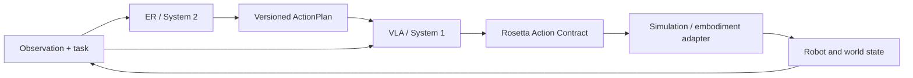
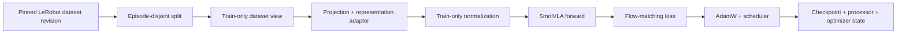
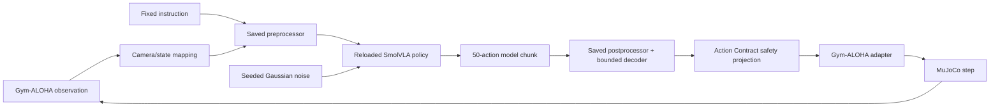
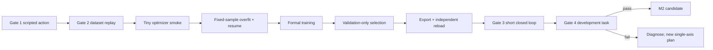

# M2 SmolVLA architecture and navigation

This is the stable architecture and navigation entry point for the current
SmolVLA M2 work. It is intentionally not named after a furnace or date. Update
this file when component ownership, execution boundaries, the current evidence
source, or the next repair stage changes.

Document updated: 2026-08-13. Current Faust evidence snapshot: 2026-08-12.

## 1. Mandatory reading order and authority

Before changing SmolVLA data, processors, trainers, optimizers, checkpoints,
exports, evaluation or simulation, read in this order:

1. `AGENTS.md` — safety, runtime, stage-gate and repository rules;
2. this file — stable component, control-flow and evidence map;
3. `reports/training/m2-smolvla-faust-trainer-optimizer-audit-2026-08-12.md`
   — current empirical interpretation and repair order;
4. `reports/training/m2-smolvla-faust-trainer-optimizer-audit-2026-08-12.json`
   — machine-readable result and finding registry;
5. the registered experiment, formal-run and simulation configs named below;
6. immutable `runs/` and `artifacts/` evidence referenced by those reports;
7. implementation code and tests for the component being changed.

Authority is layered rather than interchangeable:

| Question | Source of truth |
|---|---|
| What is allowed and where may it run? | `AGENTS.md` |
| Which component owns a behavior? | this architecture document plus executable code |
| What was preregistered for a run? | the hash-bound config for that run |
| What physical action semantics apply? | `configs/sim/aloha_insertion_smolvla.yaml` |
| What actually completed? | immutable machine-readable evidence under `runs/` and `artifacts/` |
| Why did the result pass or fail? | the current audit Markdown and JSON |

If prose conflicts with a hash-bound config, Action Contract, code assertion or
evidence file, stop and reconcile the mismatch. Do not silently select the
convenient source. Historical reports remain provenance and must not be edited
to make a later result appear successful.

## 2. Current M2 status

The current work line is **VLA / System 1**, not Qwen ER.

| Field | Current state |
|---|---|
| development policy | revision-pinned `lerobot/smolvla_base` 450M |
| upstream LeRobot revision | `c903b114a90e703b3f7d0c46cb38727c328c55ff` |
| base model revision | `c83c3163b8ca9b7e67c509fffd9121e66cb96205` |
| dataset | `lerobot/aloha_sim_insertion_human` |
| dataset revision | `cc571a3c661df81b566dbfde3d5c1e85fcdf7884` |
| split | 40 train / 5 validation / 5 sealed hidden test episodes |
| repaired experiment | `m2-smolvla450m-aloha-insertion-action-repair-bounded-gripper-003` |
| completed formal run | `m2-smolvla450m-faust-b8-002` |
| selected checkpoint | Faust step 1875 |
| export/reload | passed with exact action equality |
| Gate 3 | passed |
| Gate 4 | failed, `0/5` task success |
| M2 completion | **not complete** |
| hidden test | not loaded |

Faust proves that the repaired standard-action boundary is legal and survives
checkpoint export/reload. It does not prove a successful closed-loop policy.
No new full furnace is authorized merely by this status snapshot.

## 3. System boundary

Rosetta Reality separates low-frequency reasoning, high-frequency control and
embodiment execution:



The current M2 evaluation does not claim ER/VLA integration. It conditions
SmolVLA with a fixed insertion instruction and directly evaluates the VLA,
Action Contract and simulator loop. M3 remains blocked until M2 Gate 4 passes
and Qwen ER independently passes its own evaluation.

## 4. Repository ownership map

| Path | Owns | Must not own |
|---|---|---|
| `docs/architecture.md` | model-independent ER/VLA system overview | current furnace status |
| `docs/er-vla-pipeline.md` | original role, reuse and gate design | current completed-result authority |
| `docs/m2-smolvla-architecture.md` | stable current M2 navigation and component map | immutable run evidence |
| `configs/vla/` | VLA experiment, formal-run and evaluation identities | simulator actuator implementation |
| `configs/sim/aloha_insertion_smolvla.yaml` | complete physical Action Contract | model training hyperparameters |
| `src/rosetta_reality/vla/action_space.py` | experiment/action-space schema loading and identity checks | MuJoCo calls |
| `src/rosetta_reality/vla/processor.py` | dataset-to-model and model-to-standard-action boundary | task success logic |
| `src/rosetta_reality/vla/checkpoint_memory.py` | save/resume memory-boundary handling | optimizer policy |
| `src/rosetta_reality/vla/fixed_samples.py` | deterministic diagnostic sample identity | train/validation split selection |
| `src/rosetta_reality/sim/` | simulator-neutral action contract and Gym-ALOHA adapter | SmolVLA internals |
| `src/rosetta_reality/eval/` | metrics and trajectory diagnostics | optimizer updates |
| `src/rosetta_reality/tracking/` | durable Trackio bridge and sanitized payloads | checkpoint weights or secrets |
| `scripts/run_smolvla_action_repair_formal.py` | plan/prerequisite validation and formal launch assembly | upstream flow-loss implementation |
| `scripts/train_smolvla_action_repair_formal.py` | runtime injection into the pinned LeRobot trainer | experiment selection decisions |
| `scripts/evaluate_smolvla_action_repair_validation.py` | offline validation reports | hidden-test selection |
| `scripts/select_smolvla_action_repair_checkpoint.py` | validation-only checkpoint selection | Gate 4 acceptance |
| `scripts/export_smolvla_action_repair.py` | deploy artifact and exact independent reload | further training |
| `scripts/smolvla_action_repair_sim_gate.py` | Gate 3/4 closed-loop execution and reports | training loss |
| `src/rosetta_reality/vla/training/` | version-2 plan-driven composition layer for the pinned LeRobot trainer: plan schema, ordered feature registry with install/restore and rollback, launch assembly (see `docs/m2-smolvla-training-harness-v2.md`) | the upstream training loop, learning semantics, or mutation of the frozen historical trainer stack |
| `scripts/run_smolvla_v2.py` | the single version-2 launcher validation chain, launch manifest and mode dispatch | bypassing prerequisite evidence or authorizing a furnace by itself |
| `scripts/train_smolvla_v2.py` | the single version-2 trainer entry installing plan-declared features on the pinned LeRobot trainer | experiment selection or evaluation semantics |
| `reports/training/` | human and machine-readable interpretation | mutable checkpoints |
| ignored `runs/` and `artifacts/` | immutable local runtime evidence and deploy artifacts | tracked source code |

Important boundary: `src/rosetta_reality/train/losses.py` contains generic and
historical Rosetta action losses. Faust does **not** use those functions for its
SmolVLA flow-matching objective. The active Faust loss, trainer, AdamW builder
and scheduler come from the pinned LeRobot source. Changing the generic loss
file alone cannot fix finding T1.

Trainer composition boundary: future SmolVLA training plans use the version-2
harness (`src/rosetta_reality/vla/training/` plus `scripts/run_smolvla_v2.py`
and `scripts/train_smolvla_v2.py`), where an ordered, hash-bound `features`
list is the only way local extensions enter the pinned trainer. The historical
`train_smolvla_*` / `run_smolvla_*` stack is frozen as provenance for the
completed Faust, Aster and Way identities and must not be extended or edited.
The v2 rewrite changes no learning semantics and does not authorize a new
furnace by itself; see `docs/m2-smolvla-training-harness-v2.md`.

Do not edit a dependency cache in place. A trainer/loss/scheduler experiment
must be implemented as an explicit local extension or controlled injection,
covered by tests, checksum-bound to a new plan and compared against the frozen
Faust control.

## 5. Registered configuration chain

The current repaired chain is:

```text
configs/vla/smolvla_450m_aloha_insertion_action_repair_bounded_gripper_003.yaml
        |
        +-- action-space and repaired processor contract
        |
        v
configs/vla/smolvla_450m_aloha_insertion_faust_batch8_002.yaml
        |
        +-- immutable formal optimizer/scheduler/resource plan
        |
        v
Faust checkpoints -> validation selection -> exported deploy artifact
        |
        v
configs/vla/smolvla_450m_aloha_insertion_faust_sim_001.yaml
        |
        v
Gate 3 -> Gate 4
```

The formal Faust config and completed evidence are historical identities. A new
loss, optimizer, batch, scheduler, adaptation, data or evaluation hypothesis
requires a new config and run identity. Never mutate Faust and resume under the
same name.

## 6. Training data and action architecture

### 6.1 Data identity



- Train episodes alone create normalization statistics.
- Validation episodes select checkpoints.
- Hidden-test episodes `[31, 6, 1, 24, 5]` stay sealed until the registered
  protocol allows them. Faust did not load them.
- Episode identity and frame alignment are preserved; action chunks never cross
  episode boundaries.

### 6.2 Standard action to model space

The registered action space is 14-D absolute ALOHA joint position at 50 Hz.
Dimensions 6 and 13 are left and right grippers.

Training targets pass through this order:

```text
raw standard-ALOHA target
    -> Action Contract projection
    -> reject source values beyond registered tolerance
    -> pi-Aloha arm representation
    -> bounded-sine gripper representation
    -> train-only mean/std normalization
    -> SmolVLA model space
```

For a projected standard gripper target `g` in `[0, 1]`, the repaired internal
target is `asin(2g - 1)`. At inference, any internal gripper value `x` decodes
through `(sin(x) + 1) / 2`, guaranteeing a standard-space result in `[0, 1]`.

The model config keeps upstream `adapt_to_pi_aloha = false` because the Rosetta
processor boundary owns the conversion. Turning both paths on would double-
transform state/actions and violate the registered identity.

The sine decoder fixes physical output bounds but is periodic. Legal output is
therefore not proof that the internal gripper latent stayed inside training
support. The audit's T6 diagnostic remains required.

### 6.3 Active training objective

The pinned SmolVLA model predicts a 50-action chunk and computes elementwise
flow-matching MSE over valid horizon/action entries, followed by a uniform mean.
Faust used:

- `n_obs_steps = 1`;
- `chunk_size = 50`;
- `n_action_steps = 1` at execution;
- `freeze_vision_encoder = true`;
- `train_expert_only = true`;
- `train_state_proj = true`;
- disabled dataset image transforms.

This creates the confirmed T1 contract mismatch: training weights the full
chunk uniformly while the current controller executes only the first action
before observing again. A repair must change the active SmolVLA flow-loss path,
not merely an offline MAE calculation.

### 6.4 Optimizer and checkpoint boundary

Faust's registered optimizer contract was AdamW with LR `1e-4`, betas
`(0.9, 0.95)`, epsilon `1e-8`, weight decay `1e-10`, global clip norm `10`,
125 warmup steps and cosine decay to `2.5e-6` over 2,500 updates.

The local formal runner validates and assembles this contract. The pinned
LeRobot trainer performs forward/backward, clipping, optimizer stepping and
scheduler stepping. A complete training checkpoint must preserve:

- model weights and policy config;
- preprocessor/postprocessor state and statistics;
- optimizer state;
- scheduler state;
- run/config identity;
- RNG and dataloader continuation identity when formal resume is implemented.

The fixed-overfit path tested resume memory handling. The formal Faust runner
still has only `preflight`, `smoke` and `train` modes, so exact formal batch-8
resume parity remains unproven.

## 7. Inference, export and closed-loop architecture



Current simulation semantics:

- simulator camera `top` maps to policy camera
  `observation.images.camera1`;
- instruction is `Insert the peg into the socket.`;
- policy sampling uses seeded upstream standard-normal noise;
- only the first action of each predicted chunk is executed;
- the next observation is collected immediately after that action;
- unprojected decoder output is retained as a diagnostic;
- Action Contract projection remains the final safety boundary before the
  simulator adapter;
- adapter-side additional clipping, invalid actions, joint-limit violations and
  unexpected collisions are reported.

Export is a semantic operation, not just weight copying. A deploy artifact must
contain the saved preprocessor/postprocessor and bounded action boundary, then
pass independent reload. Faust's selected artifact produced exact action
equality after reload.

## 8. Gate and evidence state machine



Current state:

| Stage | Result | Meaning |
|---|---|---|
| Gate 1 scripted action | passed | actuator ordering, direction and limits are usable |
| Gate 2 dataset replay | passed | expert action semantics reach the task in the simulator |
| bounded processor diagnostics | passed | repaired representation round-trips and bounds hold |
| smoke / fixed overfit / resume | passed | optimizer path can learn the bounded fixed sample set |
| Faust formal training | completed | finite batch-8 run with four checkpoints |
| validation selection | passed | step 1875 selected without hidden-test access |
| export/reload | passed | deploy artifact reproduces the action exactly |
| Gate 3 | passed | short observation-action-observation loop is safe |
| Gate 4 | **failed** | zero successful tasks in five 500-step rollouts |

Gate 4 failure returns the workflow to diagnosis. It does not authorize a larger
model, more seeds, more epochs or a new optimizer by itself.

## 9. Current repair routing map

The detailed evidence and acceptance criteria live in the audit. Use this table
to find the owning layer before editing:

| Finding | Owning layer / entry point | First required evidence |
|---|---|---|
| T1 executed-horizon loss mismatch | pinned SmolVLA flow loss plus a new explicit local extension/injection | unreduced horizon/action loss parity and a tiny controlled weighting test |
| T2 no recovery distribution | dataset/recovery collection plus state-conditioned simulation oracle | first-deviation trace and revisioned recovery labels |
| T3 validation noise mismatch | `scripts/evaluate_smolvla_action_repair_validation.py` and new evaluation config | fixed Gaussian seed ensemble matching deployment |
| T4 state-dominant shortcut | `scripts/diagnose_smolvla_action_repair_modalities.py` plus new single-axis configs | per-module gradients and controlled image/history ablations |
| T6 periodic gripper latent | `src/rosetta_reality/vla/processor.py` | internal-support rate plus endpoint and standard-bound tests |
| T7 formal resume gap | formal runner/trainer and `checkpoint_memory.py` | uninterrupted versus stop/resume parity |
| T9 checkpoint/log mismatch | formal plan validation and checkpoint writer | exact same-step metric/resource snapshot |
| T10 missing failure trace | `scripts/smolvla_action_repair_sim_gate.py` and `src/rosetta_reality/eval/diagnostics.py` | object/EEF/reward/raw-action first-deviation window |
| O2 clipping observability | local instrumentation around pinned LeRobot trainer | pre/post-clip global and per-module norms |
| O3 scheduler peak semantics | local scheduler contract/extension, not dependency-cache edits | exact LR sequence around warmup and final step |

Do not combine these repairs into one furnace. Instrumentation and resume parity
may share a no-training implementation change, but each learning hypothesis
needs its own registered comparison.

## 10. Next safe work sequence

The current next sequence is:

1. add exact checkpoint metrics, pre/post-clip and per-module optimizer
   diagnostics;
2. add formal resume parity;
3. align validation noise with deployment and add first-deviation traces;
4. run a tiny controlled executed-horizon loss experiment;
5. test gripper internal-support handling;
6. add a small, revisioned recovery dataset using a state-conditioned oracle;
7. only then consider history, image augmentation, differential LR, weight
   decay, EMA or backbone adaptation as separate axes.

Before optimizer work, a new plan must freeze the hypothesis, data/model/code
identity, resource budget, optimizer/scheduler contract, validation protocol,
Gate 3/4 protocol and stop conditions. Reuse Faust only as a read-only control.

## 11. Common wrong turns

- Do not treat Qwen frozen-feature action-head work as the current VLA.
- Do not initialize SmolVLA from Odyssey, Don Quixote, Moby Dick or Faust unless
  a new controlled warm-start experiment explicitly authorizes it.
- Do not assume `src/rosetta_reality/train/losses.py` changes the SmolVLA flow
  loss.
- Do not infer compatibility from action tensor shape.
- Do not treat offline MAE, finite loss, a positive reward or Gate 3 as Gate 4
  success.
- Do not use time-indexed expert actions as recovery labels after deviation.
- Do not select on hidden-test episodes.
- Do not omit processor state from checkpoint export/reload.
- Do not run ML, data, training, evaluation or simulation from native Windows
  Python or the WSL host Python; use the Docker path launched from WSL Bash.
- Do not edit ignored evidence to make a run pass.
- Do not change multiple learning axes in one comparison.

## 12. Verification entry points

Run these from the repository root in WSL Bash through the pinned Docker path:

```bash
scripts/run_m2_container.sh vla-xpu \
  python -m pytest -q \
  tests/test_smolvla_action_repair.py \
  tests/test_smolvla_faust_protocol.py \
  tests/test_smolvla_formal_protocol.py \
  tests/test_smolvla_training_plan_schema.py \
  tests/test_smolvla_training_features.py \
  tests/test_smolvla_training_launch.py

scripts/run_m2_container.sh vla-xpu \
  python -m ruff check \
  src/rosetta_reality/vla \
  src/rosetta_reality/vla/training \
  scripts/run_smolvla_v2.py \
  scripts/train_smolvla_v2.py \
  scripts/run_smolvla_action_repair_formal.py \
  scripts/train_smolvla_action_repair_formal.py \
  scripts/evaluate_smolvla_action_repair_validation.py \
  scripts/export_smolvla_action_repair.py \
  scripts/smolvla_action_repair_sim_gate.py
```

These are code/protocol checks, not authorization to launch another formal run.

## 13. Architecture update rule

Update this document in the same change whenever any of the following changes:

- component ownership or a major entry point;
- dataset/model/Action Contract boundary;
- processor or action representation;
- trainer, loss, optimizer, scheduler or formal resume architecture;
- export/reload or closed-loop control flow;
- the current audit source or Gate 4 status;
- the next registered repair stage.

Keep dated audits and machine evidence append-only. If the stable path ever
changes, update `AGENTS.md`, `README.md` and `docs/architecture.md` together.
Tracked architecture and handoff files must contain only repository-relative
paths.
